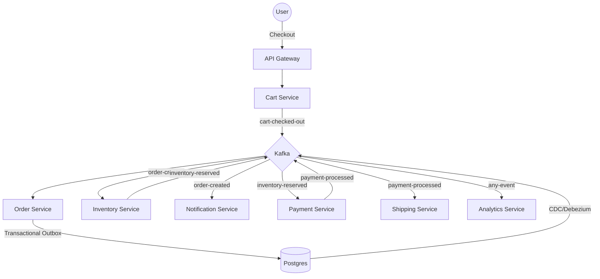

# Project Overview: Kafka Event-Driven E-Commerce Platform

## Purpose
The Kafka Event-Driven E-Commerce Platform is a production-grade, distributed system designed to demonstrate modern microservices patterns using Apache Kafka as the central nervous system. It provides a robust framework for building scalable, resilient, and loosely coupled e-commerce applications capable of handling high-throughput transactional data while ensuring eventual consistency across services.

## Concept
At its core, the platform shifts from traditional synchronous request-response architecture (REST-heavy) to an **asynchronous event-driven architecture (EDA)**. Instead of services calling each other directly, they emit "facts" (events) about state changes to Kafka topics. Other services subscribe to these topics and react accordingly.

### Key Pillars:
- **Eventual Consistency:** Using the Saga pattern to manage distributed transactions.
- **Reliable Emission:** Implementing the Transactional Outbox pattern to ensure events are never lost.
- **Schema First:** Utilizing Avro and Confluent Schema Registry for robust contract management.
- **Observability:** Full-stack monitoring with Prometheus, Grafana, and Jaeger.

## Why it Exists
In a modern banking or e-commerce environment (like NatWest), synchronous calls create "distributed monoliths" where a single service failure can cascade across the entire system. This project exists to show how to:
1.  **Decouple Services:** Allow teams to deploy and scale services independently.
2.  **Ensure Data Integrity:** Solve the "Dual Write" problem using CDC (Change Data Capture).
3.  **Scale Elastically:** Leverage Kafka's partitioning for horizontal scalability.

## Real World Usage
- **Retail/E-Commerce:** Handling orders, inventory, and shipping updates in real-time.
- **Banking (NatWest Context):** Payment processing, fraud detection, and ledger updates where audit trails and reliability are non-negotiable.
- **Logistics:** Real-time tracking of shipments and automated notifications.

## Execution Flow (Happy Path)
1.  **User Service:** User signs up (Emits `user-created`).
2.  **Cart Service:** User adds items to cart and checks out (Emits `cart-checked-out`).
3.  **Order Service:** Receives checkout event, creates a pending order, and saves to Outbox.
4.  **Debezium/Connect:** Streams the Outbox event to `order-created` Kafka topic.
5.  **Inventory Service:** Reserves stock (Emits `inventory-reserved`).
6.  **Payment Service:** Processes payment (Emits `payment-processed`).
7.  **Notification Service:** Sends email to user.
8.  **Analytics Service:** Updates dashboards.

## Mermaid Diagram: High-Level Flow

## Common Issues & Debugging
- **Schema Mismatches:** Occur when Avro schemas in `common-library` diverge from Schema Registry. 
    - *Fix:* Check `http://localhost:8081/subjects`.
- **Consumer Lag:** Visible in Kafka UI when a service can't keep up with the event rate.
    - *Fix:* Increase partitions and consumer instances.
- **Outbox Stuck:** If Debezium connector stops, events stay in `outbox_events` table.
    - *Fix:* Check Kafka Connect logs (`curl localhost:8083/connectors/outbox-connector/status`).

## Interview Questions (Senior Architect Level)
1.  **Q:** Why use the Outbox pattern instead of just sending a message in the `@Transactional` method?
    - **A:** To avoid the "Dual Write" problem. If the DB commit succeeds but the Kafka send fails (or vice-versa), the system becomes inconsistent. Outbox ensures atomicity.
2.  **Q:** How do you handle duplicate events?
    - **A:** Implement **Idempotent Consumers**. Use a unique identifier (like `correlationId` or `orderId`) to check if the event was already processed.

## Tradeoffs
| Feature | Benefit | Cost |
| :--- | :--- | :--- |
| **Event Driven** | Extreme decoupling, high scalability | Complexity in tracing, eventual consistency |
| **Avro/Schema Registry** | Strong typing, backward compatibility | Overhead of schema management |
| **Outbox Pattern** | Guaranteed delivery, no dual-writes | Extra database table, latency of CDC |
