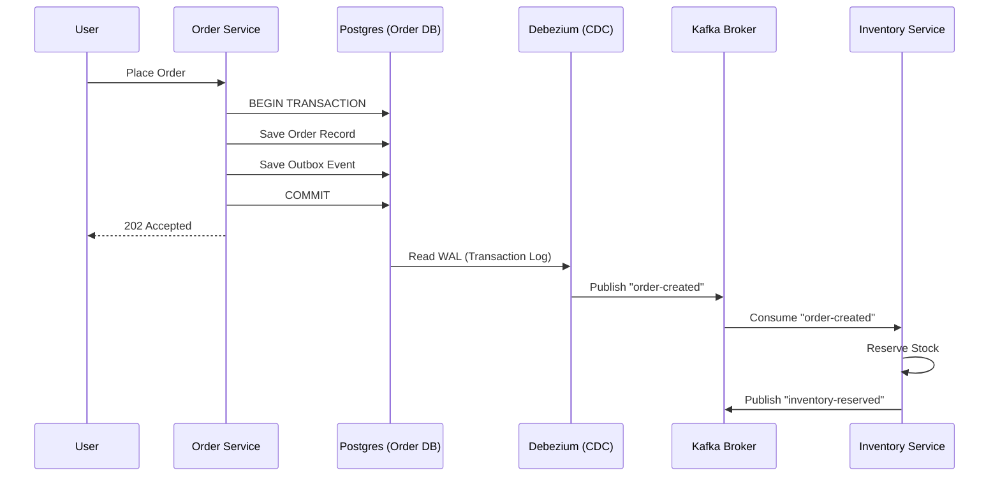

# Architecture Overview: Distributed Patterns & Event Orchestration

## Purpose
This document provides a deep dive into the architectural blueprints of the platform. It explains the "How" and "Why" behind the chosen patterns, ensuring that engineers understand the distributed nature of the system.

## Core Architectural Patterns

### 1. Choreography-Based Saga Pattern
Unlike an Orchestrator-based Saga (where one service commands others), this platform uses **Choreography**. Each service knows what to do when it hears a specific event.
- **Concept:** Services "dance" to the music (events) without a conductor.
- **Real World Usage:** Order lifecycle management across 5+ microservices.
- **Code Reference:** `SagaOutcomeListener.java` in `order-service` and various event listeners in other services.

### 2. Transactional Outbox Pattern
To ensure that a database update and a message emission happen atomically, we use the Outbox pattern.
- **Why it exists:** Prevents "ghost" orders where the DB is updated but the notification never reaches Kafka.
- **Folder Reference:** `microservices/order-service/src/main/java/com/kafka/mastery/order/entity/OutboxEvent.java`
- **Mechanism:** The service writes to its own business table AND an `outbox_events` table in the same transaction. A separate process (Debezium) polls the WAL (Write Ahead Log) and pushes to Kafka.

### 3. Change Data Capture (CDC)
We use **Debezium** running on Kafka Connect to bridge the database and Kafka.
- **Execution Flow:**
    1. Service updates Postgres.
    2. Postgres WAL records the change.
    3. Debezium reads WAL and emits a JSON/Avro message to Kafka.
- **Code Reference:** Check `docker-compose.yml` for the `connect` service configuration.

## System Components

### Infrastructure Layer (The Backbone)
- **Kafka (KRaft Mode):** Distributed event log. No Zookeeper dependency.
- **Schema Registry:** Enforces data contracts using Avro.
- **Postgres:** Primary source of truth for microservices.
- **Redis:** Used for session management and distributed locking.

### Service Layer
- **API Gateway:** Spring Cloud Gateway handles routing and authentication.
- **Domain Services:** Individual Spring Boot applications (Order, Payment, Inventory, etc.).
- **Common Library:** Shared Avro schemas and utility classes.

## Mermaid Diagram: Pattern Interaction

## Performance & Scaling
- **Partitioning Strategy:** Events are keyed by `orderId` or `userId` to ensure strict ordering for a specific entity while allowing parallel processing across partitions.
- **Idempotency:** Consumers use the `correlationId` from Avro headers to detect and ignore duplicate events.

## Common Issues & Debugging
- **Topic Auto-Creation:** If disabled, services might fail to start if topics aren't pre-created.
- **Deserialization Errors:** Usually caused by a schema evolution that isn't backward compatible.
    - *Debug:* Inspect the message in Kafka UI and compare with the local Avro class.

## Interview Questions
1.  **Q:** What is the difference between Choreography and Orchestration in Sagas?
    - **A:** Choreography is decentralized (services react to events); Orchestration is centralized (a coordinator tells services what to do). Choreography is more decoupled but harder to track.
2.  **Q:** How does KRaft improve Kafka?
    - **A:** It removes the need for Zookeeper, simplifies architecture, and allows Kafka to scale to millions of partitions more efficiently.

## Tradeoffs
| Pattern | Pros | Cons |
| :--- | :--- | :--- |
| **Choreography Saga** | Low coupling, no single point of failure | Hard to visualize the whole flow, potential for cyclic dependencies |
| **CDC / Debezium** | Transparent to the application, high reliability | Significant infrastructure overhead, complex setup |
| **KRaft Mode** | Modern, unified metadata management | Newer technology, less community documentation than Zookeeper |
