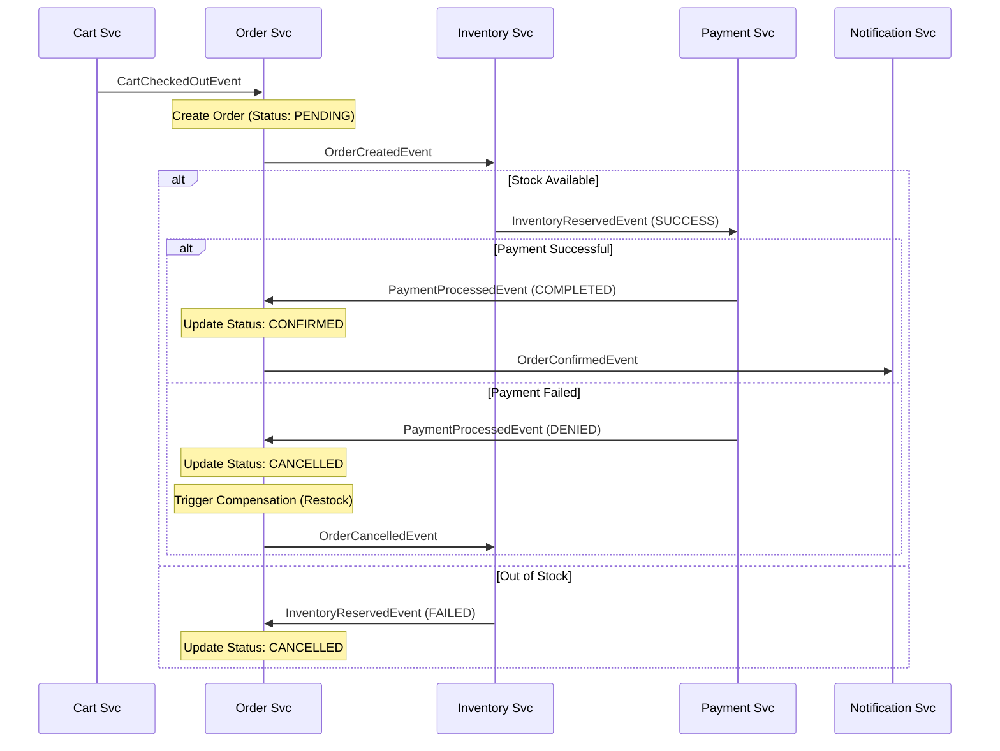

# System Design: Order Lifecycle & Performance Tuning

## Purpose
This document provides a technical deep dive into the system's operational design, focusing on the order fulfillment lifecycle, state management, and high-performance Kafka configurations.

## The Order Fulfillment Lifecycle (End-to-End)

The platform follows a multi-stage event-driven process to fulfill an order. Each stage is handled by a dedicated microservice.

### Stage 1: Checkout & Initiation
- **Trigger:** Frontend calls `POST /api/cart/checkout`.
- **Action:** `cart-service` clears the user's cart and emits `CartCheckedOutEvent`.
- **Topic:** `cart-checked-out`

### Stage 2: Order Creation (Transactional)
- **Consumer:** `order-service` (via `CartCheckedOutListener.java`).
- **Action:**
    1. Generates a new `orderId`.
    2. Saves order with status `PENDING` in Postgres.
    3. Saves `OrderCreatedEvent` in the `outbox_events` table.
- **Emission:** Debezium picks up the outbox entry and publishes to Kafka.
- **Topic:** `order-created`

### Stage 3: Inventory Reservation
- **Consumer:** `inventory-service` (via `InventoryEventListener.java`).
- **Action:** Checks stock levels. If available, reserves items.
- **Emission:** `InventoryReservedEvent` (Status: `SUCCESS` or `FAILED`).
- **Topic:** `inventory-reserved`

### Stage 4: Payment Processing
- **Consumer:** `payment-service`.
- **Action:** Charges the user's account/card.
- **Emission:** `PaymentProcessedEvent` (Status: `COMPLETED` or `DENIED`).
- **Topic:** `payment-processed`

### Stage 5: Order Confirmation/Failure
- **Consumer:** `order-service` (via `SagaOutcomeListener.java`).
- **Action:** Updates order status to `CONFIRMED` or `CANCELLED`.
- **Emission:** `OrderConfirmedEvent`.
- **Topic:** `order-confirmed`

## Sequence Diagram: Full Saga

## Performance Tuning (Reference: order-service/application.yml)

The platform is configured for production-grade throughput and durability.

### Producer Settings (Order Service)
- **`acks: all`**: Ensures data is replicated to all in-sync replicas before acknowledging. Highest durability.
- **`enable.idempotence: true`**: Prevents duplicate messages during retries.
- **`compression.type: snappy`**: Fast compression to reduce network bandwidth.
- **`linger.ms: 20`**: Introduces a small delay to allow batching, increasing throughput.
- **`batch.size: 65536` (64KB)**: Groups messages into larger chunks for efficient I/O.

### Consumer Settings
- **`auto-offset-reset: earliest`**: Ensures no events are missed if a service goes down.
- **`specific.avro.reader: true`**: Uses the generated Java classes from the common library instead of generic Avro records.

## Common Issues & Debugging
- **Poison Pill Messages:** A message that causes the consumer to crash repeatedly.
    - *Fix:* Check logs for `SerializationException`. Use a Dead Letter Topic (DLT) strategy to move the message aside.
- **Rebalance Storms:** Occurs when many consumers join/leave a group simultaneously.
    - *Debug:* Monitor `kafka-consumer-groups.sh` for rebalance status. Increase `max.poll.interval.ms`.

## Interview Questions
1.  **Q:** How do you handle a service failure mid-Saga?
    - **A:** Using compensation events. If the Payment service fails, the Order service emits a cancellation event that the Inventory service listens to, triggering it to release the reserved stock.
2.  **Q:** What is the "Dual Write" problem, and how does this system solve it?
    - **A:** It's the risk of updating a database but failing to notify other services. We solve it using the **Transactional Outbox Pattern + CDC**.

## Tradeoffs
| Design Choice | Benefit | Drawback |
| :--- | :--- | :--- |
| **Acks=All** | Zero data loss | Higher latency for producers |
| **Snappy Compression** | Low CPU overhead, good ratio | Messages are unreadable by generic tools without decompression |
| **Transactional Outbox** | Strong consistency between DB and Kafka | Increased DB write load, requires CDC infra |
