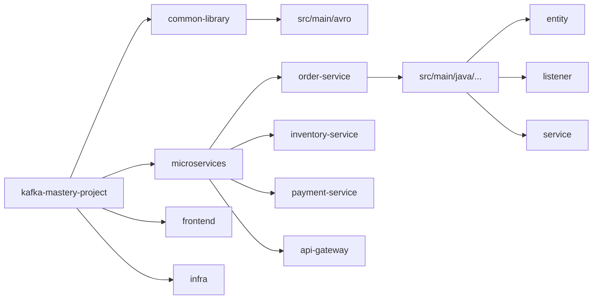

# Folder Structure: Repository Map & Key Files

## Purpose
This document provides a comprehensive mapping of the Kafka Mastery Project. It serves as a guide for day 1 engineers to navigate the codebase efficiently.

## Root Directory Overview
| Path | Responsibility |
| :--- | :--- |
| `common-library/` | Shared Avro schemas, event models, and utility classes. |
| `microservices/` | Contains all individual Spring Boot applications. |
| `frontend/` | The React + Vite client application. |
| `infra/` | Configuration for Prometheus, Grafana, and other tools. |
| `k8s/` | Kubernetes manifests for cloud deployment. |
| `docker-compose.yml` | Local development orchestration file. |
| `pom.xml` | Parent Maven configuration for the multi-module project. |

---

## Detailed Component Breakdown

### 1. `common-library/`
The "Contract Room" of the project.
- **`src/main/avro/`**: Contains `.avsc` files defining the structure of every Kafka event.
- **`src/main/java/com/kafka/mastery/common/`**: Shared logic like custom serializers or error handlers.
- **Why it exists:** To prevent duplication of event models across 10+ services.

### 2. `microservices/`
The core business logic.
- **`api-gateway/`**: Entry point for all external traffic. Handles routing.
- **`order-service/`**: Implements the Saga pattern and Outbox pattern.
    - `entity/`: Database models including `OrderEntity` and `OutboxEvent`.
    - `listener/`: Kafka consumers reacting to events like `CartCheckedOut`.
    - `service/`: Business logic for order creation and state updates.
- **`inventory-service/`**: Simple stock management and reservation logic.
- **`notification-service/`**: Listens to various events to send alerts (simulated).

### 3. `infra/`
Monitoring and configuration.
- **`prometheus/`**: Scrape configurations for microservices.
- **`grafana/`**: Pre-configured dashboards (if any) or data source settings.

---

## Key Execution Flow (File References)

1.  **Event Definition:** `common-library/src/main/avro/order-created.avsc`
2.  **Event Production:** `OrderProducerService.java` (using `KafkaTemplate`).
3.  **Outbox Entry:** `OrderProducerService.createOrderWithOutbox(...)`
4.  **Event Consumption:** `InventoryEventListener.java` (using `@KafkaListener`).
5.  **Infrastructure Setup:** `docker-compose.yml`

---

## Mermaid Diagram: Repository Tree

## Common Issues & Debugging
- **"Package not found" in Common Library:** Occurs if `mvn clean install` hasn't been run. The Avro classes are generated at build time.
    - *Fix:* Run `./mvnw clean install` from the root.
- **Docker Mount Failures:** Often caused by incorrect relative paths in `docker-compose.yml`.
    - *Debug:* Check `docker-compose logs` for "file not found" errors.

## Interview Questions
1.  **Q:** Why use a multi-module Maven project instead of separate repositories?
    - **A:** For a learning project or a tightly coupled domain, it simplifies dependency management (especially the `common-library`). In a massive organization, separate repos are often preferred for team autonomy.
2.  **Q:** Where are the Kafka Avro classes generated?
    - **A:** In the `target/generated-sources/avro` directory of the `common-library` module during the Maven `generate-sources` phase.

## Tradeoffs
| Approach | Benefit | Drawback |
| :--- | :--- | :--- |
| **Monorepo Structure** | Easy code sharing, atomic commits | Build times can become slow, harder to enforce strict boundaries |
| **Shared Common Lib** | Single source of truth for events | Any change requires all services to rebuild/redeploy |
