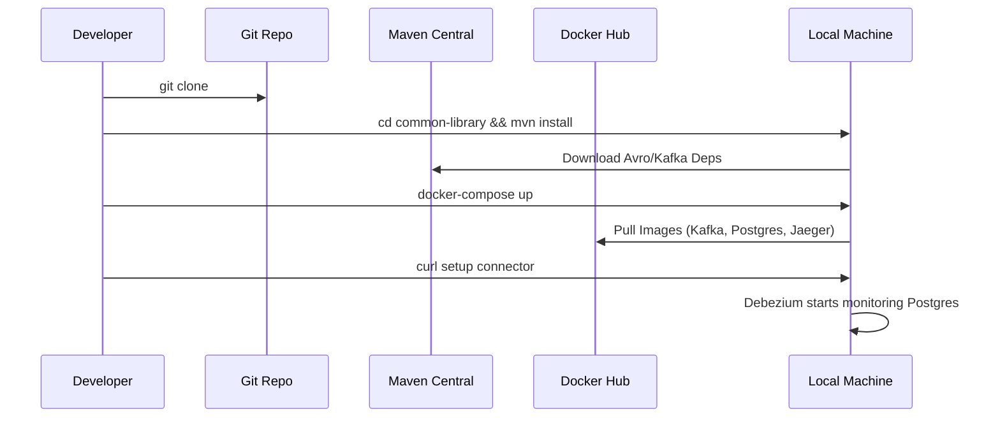

# Local Development Setup Guide

## Purpose
The Local Development Setup Guide provides a comprehensive, step-by-step roadmap for engineers to bootstrap the Kafka Event-Driven E-Commerce Platform on their local machines. It ensures consistency across development environments and minimizes the "it works on my machine" syndrome by leveraging containerization and standardized build tools.

## Concept
The platform is a polyglot-ready (primarily Java/Spring Boot) microservices architecture. It relies on a distributed infrastructure composed of Kafka brokers, a Schema Registry, PostgreSQL, and various monitoring tools. The local setup aims to replicate this production-like environment using Docker Compose while allowing for local IDE-based service development.

## Why it Exists
- **Onboarding:** Reduces time-to-first-commit for new engineers.
- **Reliability:** Standardizes the versioning of dependencies (JDK, Maven, Docker).
- **Environment Parity:** Bridges the gap between local development and cloud-native deployments (K8s).

## Real-World Usage
At NatWest, engineers use this guide to set up their feature branch environments. It allows them to run the entire stack or selectively start services they are currently modifying.

## Prerequisites
Before starting, ensure you have the following installed:
- **Java 17 (LTS):** The primary runtime for all microservices.
- **Maven 3.8+:** For dependency management and building JARs.
- **Docker & Docker Compose:** To run the infrastructure (Kafka, Postgres, etc.).
- **Node.js 18+ & npm:** For the React frontend.
- **Postman or cURL:** For API testing.
- **IntelliJ IDEA (Recommended):** With Lombok and Avro plugins.

## Folder References
- `/common-library`: Shared Avro schemas and DTOs.
- `/microservices`: Individual Spring Boot services.
- `/infra`: Monitoring and connector configurations.
- `/frontend`: React/Vite dashboard.

---

## Execution Flow: Step-by-Step Setup

### Step 1: Clone the Repository
```bash
git clone https://github.com/your-repo/kafka-mastery-project.git
cd kafka-mastery-project
```

### Step 2: Build the Shared Library
The `common-library` contains the Avro schemas. You must build this first so other services can resolve the generated Java classes.
```bash
cd common-library
mvn clean install
cd ..
```

### Step 3: Build the Microservices
Build the entire suite of services using the root POM.
```bash
mvn clean package -DskipTests
```

### Step 4: Spin up Infrastructure
Launch the Kafka brokers, Postgres, Redis, and other supporting tools.
```bash
docker-compose up -d
```
*Wait for ~30 seconds for the Kafka cluster and Schema Registry to stabilize.*

### Step 5: Initialize the Outbox Connector
The order-service uses the Transactional Outbox pattern. You need to register the Debezium connector with Kafka Connect.
```bash
curl -i -X POST -H "Accept:application/json" -H  "Content-Type:application/json" \
  http://localhost:8083/connectors/ -d @infra/debezium-outbox-connector.json
```

### Step 6: Start the Frontend
```bash
cd frontend
npm install
npm run dev
```

---

## Verification & Diagrams

### System Bootstrapping Sequence


---

## Common Issues & Debugging

| Issue | Root Cause | Resolution |
| :--- | :--- | :--- |
| `Kafka Cluster ID mismatch` | Residual data in volumes. | `docker-compose down -v` and restart. |
| `Avro class not found` | Common library not installed. | Run `mvn install` in `/common-library`. |
| `Port 5432 already in use` | Local Postgres instance running. | Stop local Postgres or change port in `docker-compose.yml`. |
| `Connection refused (8081)` | Schema Registry not ready. | Check logs: `docker logs schema-registry`. |

### Debugging Commands
- **Check infrastructure health:** `docker-compose ps`
- **Follow logs for a specific service:** `docker-compose logs -f kafka-1`
- **Verify Kafka topics:** `docker exec -it kafka-1 kafka-topics --list --bootstrap-server localhost:9092`
- **Check Debezium status:** `curl http://localhost:8083/connectors/outbox-connector/status`

---

## Interview Questions
1. **Why do we build the `common-library` first?**
   *Answer: Because it contains the Avro schema definitions that generate Java classes required as dependencies by all other microservices.*
2. **What is the purpose of the Kafka Connect step in the setup?**
   *Answer: It initializes the Debezium connector which enables the Transactional Outbox pattern, ensuring data consistency between the Postgres DB and Kafka.*

## Tradeoffs
- **Docker Compose vs. Local Binaries:** Using Docker Compose ensures environmental consistency but consumes significant system RAM (~8GB+ recommended).
- **Snapshot Versions:** Using `0.0.1-SNAPSHOT` for the common library allows for rapid schema iteration but requires frequent `mvn clean install` calls by team members.
