# Docker Infrastructure Documentation

## Purpose
The Docker Infrastructure defines the "spine" of the E-Commerce platform. It encapsulates the complex distributed systems (Kafka, Postgres, Redis) into a reproducible, version-controlled environment, allowing developers to simulate production-scale networking and storage locally.

## Concept
The infrastructure is built on **Docker Compose**, utilizing a multi-node Kafka cluster running in **KRaft mode**. It integrates **Change Data Capture (CDC)** via Debezium and provides a full observability stack (Prometheus, Grafana, Jaeger).

## Why it Exists
- **Complexity Management:** Manages 10+ infrastructure components without manual installation.
- **Isolation:** Each component runs in its own container with specific resource limits and networking.
- **Automation:** Enables "Infrastructure as Code" (IaC) principles for the local dev environment.

## Real-World Usage
Production environments at NatWest use Kubernetes (Helm/Kustomize), but the `docker-compose.yml` serves as the definitive reference for service dependencies, environment variables, and port mappings used during development and CI pipelines.

---

## Infrastructure Components

### 1. Message Backbone: Kafka KRaft Cluster
The cluster consists of 3 brokers (`kafka-1`, `kafka-2`, `kafka-3`).
- **Mode:** KRaft (No Zookeeper).
- **Consensus:** Uses a quorum of controllers to manage metadata.
- **Configuration Highlights:**
  - `KAFKA_OFFSETS_TOPIC_REPLICATION_FACTOR: 3`
  - `KAFKA_TRANSACTION_STATE_LOG_REPLICATION_FACTOR: 3`
  - **Listeners:** Supports both internal (Docker network) and external (localhost) access.

### 2. Schema Registry (Confluent)
- **Role:** Enforces data contracts using Avro.
- **Port:** `8081`
- **Dependency:** Must wait for Kafka brokers to be healthy.

### 3. Primary Storage: PostgreSQL (Debezium Flavor)
- **Role:** Source of truth for orders, users, and products.
- **Feature:** `wal_level=logical` is enabled to support CDC.
- **Image:** `debezium/postgres:15`

### 4. Event Streaming: Kafka Connect
- **Role:** Runs the Debezium Postgres Connector.
- **Plug-in:** `debezium-connector-postgresql`
- **Conversion:** Converts Postgres WAL changes into Avro-encoded Kafka messages.

### 5. Observability Stack
- **Prometheus (9090):** Scrapes metrics from Spring Boot Actuators and Kafka.
- **Grafana (3000):** Visualizes performance (Dashboards in `/infra/grafana`).
- **Jaeger (16686):** Distributed tracing (OTLP) to track requests across microservices.

---

## Architecture Diagram

```mermaid
graph TD
    subgraph "Docker Network"
        K1[Kafka Broker 1]
        K2[Kafka Broker 2]
        K3[Kafka Broker 3]
        SR[Schema Registry]
        KC[Kafka Connect]
        DB[(PostgreSQL)]
        RD[(Redis)]
        PROM[Prometheus]
        GRAF[Grafana]
        JAG[Jaeger]
    end

    DB -->|WAL Logs| KC
    KC -->|Avro Events| K1
    KC -->|Avro Events| K2
    KC -->|Avro Events| K3
    SR --- K1
    SR --- K2
    SR --- K3
    PROM -->|Scrape| K1
    GRAF -->|Query| PROM
```



---

## Configuration Details (docker-compose.yml)

### Kafka KRaft Snippet
```yaml
environment:
  KAFKA_PROCESS_ROLES: 'broker,controller'
  KAFKA_CONTROLLER_QUORUM_VOTERS: '1@kafka-1:29093,2@kafka-2:29093,3@kafka-3:29093'
  KAFKA_LISTENERS: 'PLAINTEXT://kafka-1:29092,CONTROLLER://kafka-1:29093,PLAINTEXT_HOST://0.0.0.0:9092'
```

### Kafka Connect Snippet
```yaml
environment:
  CONNECT_BOOTSTRAP_SERVERS: 'kafka-1:29092,kafka-2:29092,kafka-3:29092'
  CONNECT_VALUE_CONVERTER: io.confluent.connect.avro.AvroConverter
  CONNECT_VALUE_CONVERTER_SCHEMA_REGISTRY_URL: http://schema-registry:8081
```

---

## Debugging & Common Issues

| Issue | Debugging Step |
| :--- | :--- |
| **Containers exiting with code 137** | Memory pressure. Increase Docker Desktop RAM to 8GB+. |
| **Kafka Connect "Plugin not found"** | Check if `confluent-hub install` succeeded in `docker-compose logs connect`. |
| **Schema Registry "Master not found"** | Kafka brokers are still electing a leader. Wait and restart SR. |
| **Prometheus not scraping** | Verify `extra_hosts: ["host.docker.internal:host-gateway"]` is present for host-based services. |

---

## Interview Questions
1. **Why use KRaft instead of Zookeeper?**
   *Answer: KRaft simplifies architecture by removing the external Zookeeper dependency, reducing metadata latency, and improving cluster scalability by using Kafka's own log-based replication for metadata.*
2. **What is the significance of `wal_level=logical` in Postgres?**
   *Answer: It allows the database to write extra information to the Write-Ahead Log, which Debezium reads to reconstruct row-level changes for event streaming.*

## Tradeoffs
- **High Availability (HA) Simulation:** Running 3 Kafka brokers and 3 controllers locally is resource-heavy but necessary to test failover scenarios and partition rebalancing accurately.
- **Confluent vs. Apache Kafka:** Using Confluent images provides the Schema Registry and Connect components out of the box, but ties the infrastructure slightly to the Confluent ecosystem.
