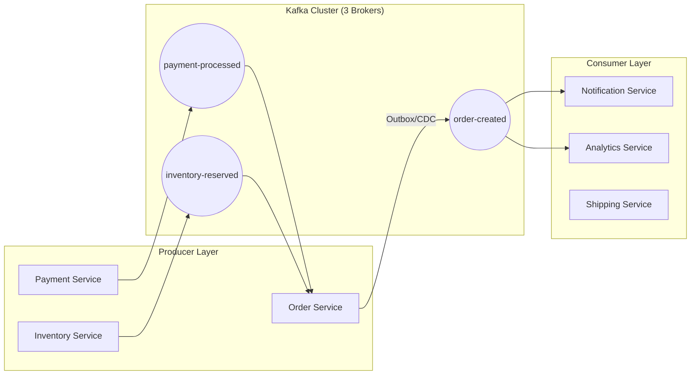

# Kafka Architecture Documentation

## Purpose
The Kafka Architecture document explains how the platform utilizes Apache Kafka as its distributed event store and stream processing engine. It covers the cluster design, producer/consumer patterns, and the critical "Transactional Outbox" pattern used for reliable event emission.

## Concept
The platform treats Kafka not just as a message queue, but as the **Log of Truth**. Every state change in the system (Order Created, Payment Processed, Stock Reserved) is recorded as an immutable event in a Kafka topic, enabling decoupling, scalability, and re-playability.

## Why it Exists
- **Decoupling:** Services don't need to know about each other; they only care about events.
- **Resilience:** If the Notification Service is down, events are buffered in Kafka until it recovers.
- **Auditability:** Every event is stored, providing a perfect audit trail of all business transactions.

## Real-World Usage
At NatWest, this architecture ensures that a spike in order volume doesn't crash the payment or shipping systems, as they can consume events at their own pace.

---

## Cluster Architecture (KRaft Mode)

The system runs a **multi-node KRaft cluster**. KRaft replaces Zookeeper by using a dedicated group of brokers (Controllers) that use the **Raft consensus protocol** to manage cluster metadata.

### Configuration Analysis
As seen in `application.yml` and `docker-compose.yml`:
- **Replication Factor:** `3` (Ensures no data loss if one broker fails).
- **Min In-Sync Replicas (ISR):** `2` (Ensures at least two copies are acknowledged).
- **Acks:** `all` (Producer waits for all replicas to acknowledge).
- **Idempotence:** `true` (Prevents duplicate messages due to network retries).

---

## Producer & Consumer Patterns

### 1. The Transactional Outbox Pattern (Reliable Production)
To avoid the "Dual-Write" problem (where DB updates succeed but Kafka sends fail), we use the Outbox Pattern.
- **Step 1:** Service saves business entity (e.g., `Order`) AND an `OutboxEvent` in the same Postgres transaction.
- **Step 2:** Debezium (Kafka Connect) monitors the `outbox_events` table via Logical Replication.
- **Step 3:** Debezium streams the change to Kafka.
- **Code Ref:** `OrderProducerService.java` -> `createOrderWithOutbox()`

### 2. High-Throughput Producers
For non-critical events (like analytics), we use async producers with batching.
- **Batch Size:** `64KB`
- **Linger Time:** `20ms`
- **Compression:** `snappy`

### 3. Idempotent Consumers
Consumers use `group-id` and Avro `SpecificRecord` for type-safe processing.
- **Group Management:** Consumers are organized into groups (e.g., `order-group`, `payment-group`) to allow parallel processing across partitions.
- **Offset Management:** `auto-offset-reset: earliest` ensures no events are missed during service downtime.

---

## Kafka Topology Diagram



---

## Schemas & Evolution (Schema Registry)

The platform uses **Avro** for message serialization.
- **Why Avro?** It's compact (binary) and supports schema evolution (Backward/Forward compatibility).
- **Registry:** `schema-registry` at port `8081`.
- **Workflow:** Producers register the schema; Consumers download the schema by ID from the registry to deserialize messages.

---

## Debugging & Monitoring

### Key Metrics to Watch (Grafana)
- **Consumer Lag:** The delta between the latest message and the consumer's offset. High lag indicates a bottleneck.
- **Producer Retry Rate:** High rates indicate network issues or broker saturation.
- **Under-Replicated Partitions:** Indicates broker health issues.

### Useful CLI Commands
```bash
# Peek into a topic (Avro)
docker run --net=host confluentinc/cp-schema-registry:7.5.0 \
  kafka-avro-console-consumer --bootstrap-server localhost:9092 \
  --topic order-created --from-beginning --property schema.registry.url=http://localhost:8081
```

---

## Interview Questions
1. **Explain the "Dual Write" problem and how this project solves it.**
   *Answer: The Dual Write problem occurs when an application tries to update a database and send a message to Kafka in two separate operations. If one fails after the other succeeds, the system becomes inconsistent. This project solves it using the Transactional Outbox pattern with Debezium.*
2. **What happens if a consumer service crashes? Does it lose data?**
   *Answer: No. Kafka stores messages for a retention period (default 7 days). Because we use Consumer Groups and commit offsets only after processing, the service will resume from the last committed offset when it restarts.*

## Tradeoffs
- **Transactional Outbox Complexity:** Adds more moving parts (Outbox table, Kafka Connect, Debezium) compared to simple `kafkaTemplate.send()`, but guarantees consistency.
- **Avro vs. JSON:** Avro is faster and smaller but requires a Schema Registry, adding infrastructure overhead.
