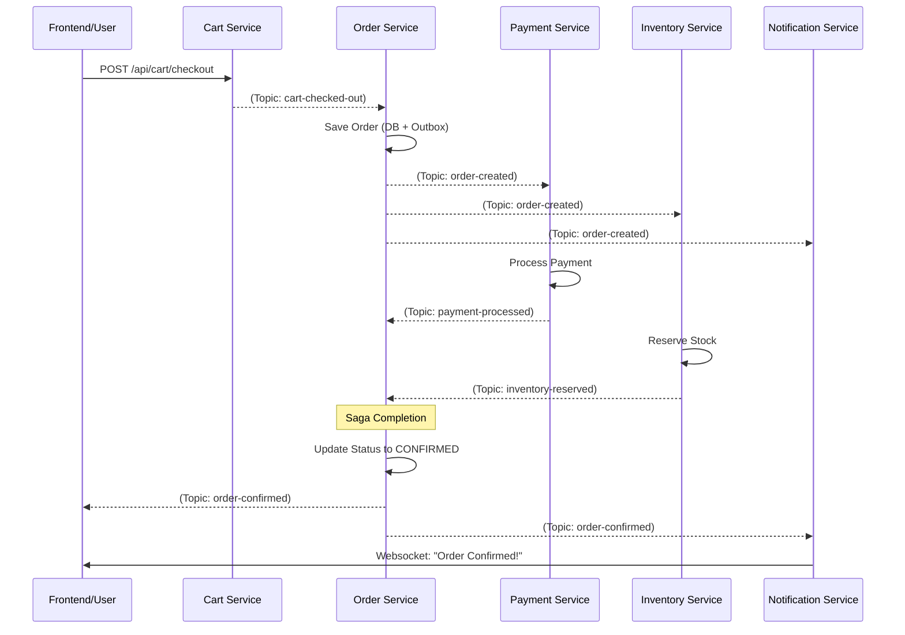

# Topic Flow & Event Choreography

## Purpose
The Topic Flow document maps out the "Event Choreography" across the platform. It provides a macroscopic view of how a single user action (like placing an order) triggers a cascade of events across multiple microservices to complete a business transaction.

## Concept
The platform uses **Choreography-based Saga** pattern. Instead of a central "orchestrator" service, each service listens for events and decides what to do next, often emitting a new event in response.

## Why it Exists
- **Traceability:** Visualizes the lifecycle of an order across service boundaries.
- **Troubleshooting:** Helps identify where a flow is stuck (e.g., if an order is created but payment is never processed).
- **Scalability:** Choreography allows services to scale independently as they only respond to topics of interest.

## Real-World Usage
At NatWest, choreography is used for multi-stage processes like mortgage applications or loan approvals, where each department completes a step and "passes the ball" via Kafka.

---

## The Primary Order Lifecycle (Happy Path)

The following sequence describes the flow from a user checking out their cart to the order being confirmed.

### 1. Cart Checkout
- **Trigger:** User clicks "Checkout" in the Frontend.
- **Service:** `cart-service`
- **Action:** Publishes `CartCheckedOutEvent` to topic `cart-checked-out`.

### 2. Order Creation (Outbox)
- **Service:** `order-service`
- **Consumer:** `CartCheckedOutListener`
- **Action:** Saves Order to DB and `OutboxEvent`.
- **Emitter:** Debezium/Kafka Connect picks up the outbox event.
- **Topic:** `order-created`

### 3. Payment Processing
- **Service:** `payment-service`
- **Consumer:** Listens to `order-created`.
- **Action:** Authorizes payment with a mock gateway.
- **Topic:** `payment-processed` (Status: `SUCCESS`)

### 4. Inventory Reservation
- **Service:** `inventory-service`
- **Consumer:** Listens to `order-created`.
- **Action:** Decrements stock count.
- **Topic:** `inventory-reserved` (Status: `SUCCESS`)

### 5. Saga Completion (Order Confirmation)
- **Service:** `order-service`
- **Consumer:** `SagaOutcomeListener` (Listens to BOTH `payment-processed` and `inventory-reserved`).
- **Action:** Once both events are received with `SUCCESS`, updates Order status to `CONFIRMED`.
- **Topic:** `order-confirmed`

---

## Event Flow Sequence Diagram

---

## Topic Inventory & Schema Mapping

| Topic Name | Producer Service | Main Consumer(s) | Event Type (Avro) |
| :--- | :--- | :--- | :--- |
| `cart-checked-out` | `cart-service` | `order-service` | `CartCheckedOutEvent` |
| `order-created` | `order-service` (via CDC) | `payment-service`, `inventory-service`, `notification-service`, `analytics-service` | `OrderCreatedEvent` |
| `payment-processed` | `payment-service` | `order-service` | `PaymentProcessedEvent` |
| `inventory-reserved` | `inventory-service` | `order-service` | `InventoryReservedEvent` |
| `order-confirmed` | `order-service` | `notification-service`, `shipping-service` | `OrderConfirmedEvent` |
| `order-shipped` | `shipping-service` | `notification-service` | `OrderShippedEvent` |

---

## Compensation & Error Flows (Rollbacks)

If a step fails (e.g., `payment-processed` with status `FAILED`), the system must perform compensating actions.
- **Payment Fails:** `order-service` updates status to `CANCELLED`. `inventory-service` must listen for `order-cancelled` (future feature) to release stock.
- **Inventory Fails:** `order-service` updates status to `CANCELLED`. `payment-service` must trigger a refund.

---

## Interview Questions
1. **What is the difference between Orchestration and Choreography in Sagas?**
   *Answer: Orchestration uses a central controller (an "Orchestrator") that tells each service what to do. Choreography relies on services listening to events and acting autonomously. Choreography is more decoupled but can be harder to visualize as the system grows.*
2. **How does the `SagaOutcomeListener` handle the "Join" of two events (Payment and Inventory)?**
   *Answer: It uses a local state (e.g., `ConcurrentHashMap` or a Saga DB table) to track which events have arrived for a specific `orderId`. Once all required "legs" of the saga are complete, it triggers the final confirmation.*

## Tradeoffs
- **Eventual Consistency:** The UI might show "Created" for a few seconds before switching to "Confirmed". This requires better UX (spinners, websockets) compared to a synchronous "Wait for everything" approach.
- **Debugging Complexity:** Tracing a single order requires looking at logs across 4+ services. (Solution: Correlation IDs and Jaeger).
