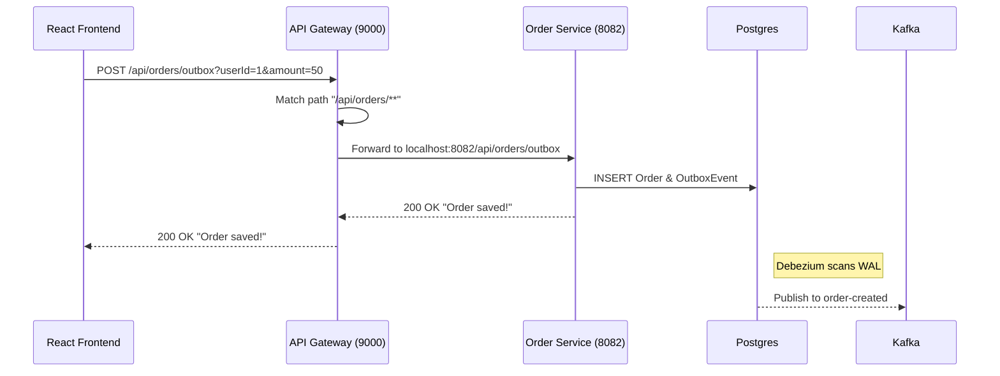

# API Documentation & Gateway

## Purpose
The API Documentation provides a clear interface for frontend developers and external integrators to interact with the platform. It documents the entry points, request/response formats, and the routing logic handled by the API Gateway.

## Concept
The platform uses an **API Gateway (Spring Cloud Gateway)** as the single entry point. The gateway handles request routing, potentially authentication (in future phases), and provides a unified URL space (`http://localhost:9000`) for all microservices.

## Why it Exists
- **Abstraction:** The frontend doesn't need to know the specific ports of 10+ microservices.
- **Security:** Provides a centralized place to implement CORS, Rate Limiting, and Auth.
- **Simplicity:** Enables a cleaner API structure (e.g., `/api/orders` instead of `localhost:8082`).

## Real-World Usage
At NatWest, API Gateways are used to expose internal services to mobile apps and partner banks (Open Banking) while enforcing strict security policies at the perimeter.

---

## API Gateway Configuration

The Gateway runs on port **9000** and routes traffic based on path predicates defined in `application.yml`.

| Path Prefix | Target Service | Internal Port |
| :--- | :--- | :--- |
| `/api/orders/**` | `order-service` | `8082` |
| `/api/users/**` | `user-service` | `8088` |
| `/api/products/**` | `product-service` | `8089` |
| `/api/cart/**` | `cart-service` | `8090` |
| `/api/payments/**` | `payment-service` | `8084` |
| `/api/inventory/**` | `inventory-service` | `8085` |
| `/api/analytics/**` | `analytics-service` | `8086` |
| `/api/notifications/**` | `notification-service` | `8087` |
| `/api/shipping/**` | `shipping-service` | `8091` |

---

## Core Endpoints

### 1. Order Service (`/api/orders`)

| Method | Endpoint | Description | Payload Example |
| :--- | :--- | :--- | :--- |
| **POST** | `/outbox` | Places an order using the Transactional Outbox pattern. | `?userId=user123&amount=99.99` |
| **POST** | `/async` | Places an order using standard async Kafka production. | `?userId=user123&amount=99.99` |
| **POST** | `/sync` | Places an order and waits for Kafka ACK (blocking). | `?userId=user123&amount=99.99` |

### 2. Cart Service (`/api/cart`)

| Method | Endpoint | Description |
| :--- | :--- | :--- |
| **POST** | `/add` | Adds an item to the user's redis-backed cart. |
| **POST** | `/checkout` | Triggers the `CartCheckedOutEvent`. |

### 3. User Service (`/api/users`)

| Method | Endpoint | Description |
| :--- | :--- | :--- |
| **POST** | `/` | Creates a new user and emits `UserCreatedEvent`. |
| **GET** | `/{id}` | Retrieves user profile. |

---

## Execution Flow: A Request's Journey



---

## Testing APIs with cURL

### Create an Order via Outbox
```bash
curl -X POST "http://localhost:9000/api/orders/outbox?userId=ritesh&amount=250.00"
```

### Health Check (via Gateway)
```bash
curl http://localhost:9000/api/orders/actuator/health
```

---

## Debugging Steps

| Issue | Step |
| :--- | :--- |
| **404 Not Found** | Verify the service is running and the route prefix matches in `api-gateway/application.yml`. |
| **504 Gateway Timeout** | The downstream service is likely down or slow. Check `docker-compose ps`. |
| **CORS Errors** | Check Gateway's CORS configuration (usually in a `WebFluxConfig` bean or `application.yml`). |

---

## Interview Questions
1. **Why use an API Gateway instead of letting the frontend call services directly?**
   *Answer: To provide a single entry point, hide internal network details, centralize cross-cutting concerns (Auth, Logging, Rate Limiting), and simplify client-side code by avoiding complex CORS configurations for multiple domains.*
2. **How does the Gateway handle a service instance going down?**
   *Answer: In a production setup with a Service Registry (like Eureka or K8s DNS), the Gateway would automatically stop routing traffic to unhealthy instances. In this local setup, it will return a `503 Service Unavailable` or `504 Gateway Timeout`.*

## Tradeoffs
- **Single Point of Failure:** If the Gateway goes down, the entire API is inaccessible. In production, the Gateway itself must be highly available (multiple instances behind a Load Balancer).
- **Latency:** Every request has an extra hop through the Gateway. However, this is usually negligible compared to the benefits of abstraction and security.
