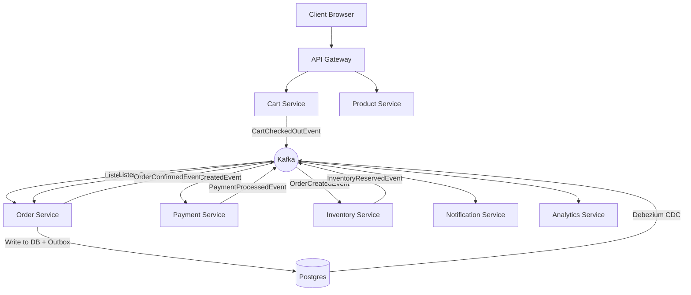

# Microservices Deep Dive

## Purpose
The Kafka Event-Driven E-Commerce Platform is built on a highly decoupled microservices architecture. Each service is responsible for a specific business domain, adhering to the "Single Responsibility Principle." Communication is primarily asynchronous via Kafka, ensuring high availability and fault tolerance.

## Core Microservices Architecture

### 1. API Gateway
- **Folder**: `microservices/api-gateway`
- **Role**: The single entry point for all client requests (Web/Mobile).
- **Responsibilities**: 
    - Request routing to downstream services.
    - Authentication/Authorization (JWT validation).
    - Rate limiting and Load balancing.
- **Tech Stack**: Spring Cloud Gateway.

### 2. User Service
- **Folder**: `microservices/user-service`
- **Role**: Manages user profiles, authentication, and preferences.
- **Key Events**: `UserCreatedEvent`.

### 3. Product Service
- **Folder**: `microservices/product-service`
- **Role**: Maintains the product catalog, categories, and pricing.
- **Key Events**: `ProductPriceChangedEvent`, `ProductAddedEvent`.

### 4. Cart Service
- **Folder**: `microservices/cart-service`
- **Role**: Manages transient shopping cart data for users.
- **Execution Flow**: When a user clicks "Checkout," it emits a `CartCheckedOutEvent`.
- **Key Events**: `CartCheckedOutEvent`.

### 5. Order Service (The Coordinator)
- **Folder**: `microservices/order-service`
- **Role**: Orchestrates the order lifecycle and acts as the Saga coordinator.
- **Key Features**: Implements the **Outbox Pattern** to ensure atomicity.
- **Key Events**: `OrderCreatedEvent`, `OrderConfirmedEvent`, `OrderCancelledEvent`.

### 6. Payment Service
- **Folder**: `microservices/payment-service`
- **Role**: Interfaces with payment gateways to process transactions.
- **Logic**: Listens for `OrderCreatedEvent`, processes payment, and emits `PaymentProcessedEvent`.

### 7. Inventory Service
- **Folder**: `microservices/inventory-service`
- **Role**: Manages stock levels and reservations.
- **Logic**: Listens for `OrderCreatedEvent`, reserves items, and emits `InventoryReservedEvent`.

### 8. Analytics Service
- **Folder**: `microservices/analytics-service`
- **Role**: Real-time data processing and business intelligence.
- **Logic**: Uses **Kafka Streams** to aggregate sales and detect fraud.

### 9. Notification Service
- **Folder**: `microservices/notification-service`
- **Role**: Sends emails/SMS to users.
- **Logic**: Listens for `OrderConfirmedEvent`, `PaymentProcessedEvent` (failed), etc.

### 10. Shipping Service
- **Folder**: `microservices/shipping-service`
- **Role**: Handles logistics and delivery tracking.

---

## Service Communication Pattern



---

## Real World Usage: The Checkout Flow
1. **User** submits a checkout request.
2. **Cart Service** publishes `CartCheckedOutEvent`.
3. **Order Service** receives the event, creates a "PENDING" order, and writes to its Outbox table.
4. **Debezium** picks up the outbox entry and publishes `OrderCreatedEvent` to Kafka.
5. **Payment** and **Inventory** services process the order in parallel.
6. **Order Service** aggregates responses and finalizes the order.

---

## Folder Structure (Standardized)
Each microservice follows this structure:
```text
src/main/java/com/kafka/mastery/[service-name]/
├── config/       # Kafka, Jackson, DB Configurations
├── controller/   # REST Endpoints
├── entity/       # JPA Entities (Database Schema)
├── listener/     # Kafka Consumers (@KafkaListener)
├── repository/   # Spring Data JPA Repositories
└── service/      # Business Logic & Kafka Producers
```

---

## Tradeoffs

| Feature | Pro | Con |
|---------|-----|-----|
| **Asynchronous** | High throughput, services don't block. | Eventual consistency, complex debugging. |
| **Decoupled** | Independent scaling and deployment. | Operational overhead (many services). |
| **Event-Driven** | Naturally fits e-commerce (Sagas). | Requires robust monitoring (Tracing). |

---

## Interview Questions
1. **How do you handle a service being down in an event-driven system?**
   - *Answer*: Kafka acts as a buffer. The event stays in the topic until the service recovers and resumes consumption.
2. **What is the difference between Orchestration and Choreography Sagas?**
   - *Answer*: This project uses Choreography, where services respond to events without a central "brain" telling them what to do.

## Debugging Steps
- **Check Kafka UI**: Navigate to `localhost:8080` to see if events are stuck in topics.
- **Jaeger Tracing**: Check `localhost:16686` for end-to-end trace IDs across services.
- **Logs**: Use `docker logs -f [service-name]` to watch real-time processing.
