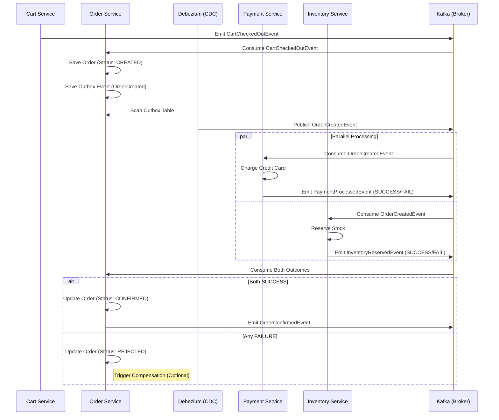

# Saga Workflow: Distributed Transactions

## Purpose
In a distributed microservices environment, maintaining data consistency across multiple databases is a challenge. Traditional ACID transactions don't work across network boundaries. The **Saga Pattern** is used to manage distributed transactions as a sequence of local transactions coordinated via events.

## Concept: Choreography-based Saga
This platform implements a **Choreography Saga**. There is no central orchestrator service. Instead, each service involved in the Saga listens for events and decides whether to perform an action or trigger a compensation.

### Why it exists
To ensure that when a user places an order:
1. The items are reserved (Inventory).
2. The payment is successful (Payment).
3. The order is confirmed only if both succeed.

## Execution Flow (Sequence Diagram)



## Code References

### 1. The Starting Point
In `CartCheckedOutListener.java`, the checkout process triggers the order creation.
```java
// order-service/.../listener/CartCheckedOutListener.java
@KafkaListener(topics = "cart-checked-out")
public void handleCartCheckedOut(CartCheckedOutEvent event) {
    orderProducerService.createOrderWithOutbox(event.getUserId(), event.getAmount());
}
```

### 2. The Coordination Logic
The `SagaOutcomeListener` in the Order Service acts as the "waiter" for the outcomes.
```java
// order-service/.../listener/SagaOutcomeListener.java
@KafkaListener(topics = "payment-processed")
public void handlePayment(PaymentProcessedEvent event) {
    // Store payment status...
    checkSagaCompletion(orderId, state);
}

@KafkaListener(topics = "inventory-reserved")
public void handleInventory(InventoryReservedEvent event) {
    // Store inventory status...
    checkSagaCompletion(orderId, state);
}
```

## Real World Usage
- **Success Scenario**: User buys a laptop. Payment is charged, stock is reduced by 1, user gets an email.
- **Partial Failure**: User buys a laptop. Payment fails. Inventory reservation is rolled back (compensation), and the user is notified.

---

## Common Issues & Debugging

### 1. Lost Events
- **Issue**: Payment succeeded, but `inventory-reserved` never arrived.
- **Debugging**: Check the `kafka-ui` for the `inventory-reserved` topic. Is the message there? Is the Order Service consumer group lagging?

### 2. Idempotency
- **Issue**: A service receives the same `OrderCreatedEvent` twice.
- **Solution**: All Saga participants MUST be idempotent. Check for `orderId` in the local DB before processing.

---

## Interview Questions
1. **How do you handle "The Dual Write Problem" in a Saga?**
   - *Answer*: By using the **Outbox Pattern**. We write the business state and the event to the same database in one transaction.
2. **What happens if the Order Service crashes before receiving all outcomes?**
   - *Answer*: The state should be persisted in a database. When the service restarts, it resumes from the last offset and checks the DB for incomplete Sagas.

## Tradeoffs

| Factor | Choreography (Current) | Orchestration |
|--------|------------------------|---------------|
| **Complexity** | Simple to start. | Harder to implement. |
| **Coupling** | Services are loosely coupled. | Centralized coupling. |
| **Visibility** | Hard to "see" the whole flow. | Clear view of the Saga state. |
| **Scalability**| Very high. | Potentially a bottleneck. |
