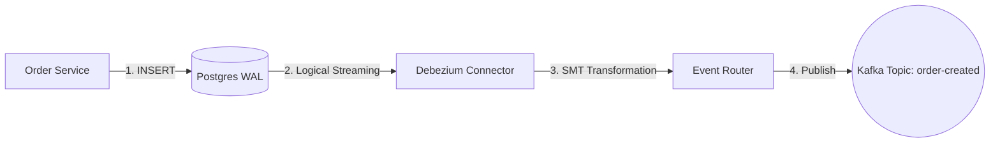

# Debezium CDC (Change Data Capture)

## Purpose
Debezium is a set of distributed services that capture changes in your databases so that your applications can see those changes and respond to them. In this project, Debezium is used to bridge the gap between the Relational Database (PostgreSQL) and the Event Bus (Kafka).

## Concept
Instead of the application code sending messages to Kafka (which can fail after the DB commit), Debezium watches the **Write-Ahead Log (WAL)** of the database. When a new row is inserted into the `outbox_events` table, Debezium captures the change and streams it to Kafka as a message.

### Why it exists
1. **Eliminate Dual Writes**: Guarantees that the database update and event publishing are atomic.
2. **Low Latency**: Captures changes almost instantly after the commit.
3. **Fault Tolerance**: If Kafka is down, Debezium remembers where it left off in the WAL.

## Configuration (JSON)
The connector is configured via a JSON file sent to the Kafka Connect REST API.

**File**: `infra/debezium-outbox-connector.json`
```json
{
  "name": "outbox-connector",
  "config": {
    "connector.class": "io.debezium.connector.postgresql.PostgresConnector",
    "tasks.max": "1",
    "database.hostname": "postgres",
    "database.port": "5432",
    "database.user": "root",
    "database.password": "password",
    "database.dbname": "ecom_db",
    "topic.prefix": "cdc",
    "table.include.list": "public.outbox_events",
    "plugin.name": "pgoutput",
    "slot.name": "debezium_outbox_slot",
    "publication.name": "debezium_publication",
    
    "transforms": "outbox",
    "transforms.outbox.type": "io.debezium.transforms.outbox.EventRouter",
    "transforms.outbox.table.field.event.id": "id",
    "transforms.outbox.table.field.event.key": "aggregate_id",
    "transforms.outbox.table.field.event.payload": "payload",
    "transforms.outbox.route.topic.replacement": "order-created",
    "transforms.outbox.route.by.field": "aggregate_type"
  }
}
```

## Key Components

### 1. The WAL (Write-Ahead Log)
PostgreSQL records every change in a log before applying it to the data files. Debezium uses "Logical Decoding" to read this log and reconstruct the changes.

### 2. SMT (Single Message Transforms)
The `EventRouter` SMT is crucial. It takes the raw database row (with `aggregate_id`, `payload`, etc.) and transforms it into a clean Kafka message, routing it to a topic based on the `aggregate_type`.

### 3. Kafka Connect
Debezium runs as a connector within the Kafka Connect framework, which handles scalability and distribution.

---

## Execution Flow



## Real World Usage
- **Outbox Pattern**: As implemented here for Order creation.
- **Cache Invalidation**: When a Product is updated in the DB, Debezium emits an event to invalidate the Redis cache.
- **Search Indexing**: Streaming changes from Postgres to Elasticsearch for real-time search.

---

## Debugging & Troubleshooting

### 1. Connector Status
Check if the connector is running:
```bash
curl -s http://localhost:8083/connectors/outbox-connector/status
```

### 2. Replication Slots
Debezium creates a "Replication Slot" in Postgres. If Debezium is stopped for too long, this slot can grow and consume disk space.
- **SQL to check**: `SELECT * FROM pg_replication_slots;`

### 3. Schema Changes
If you change the structure of the `outbox_events` table, you may need to restart the connector or update the SMT configuration.

---

## Interview Questions
1. **What is the "At Least Once" guarantee in Debezium?**
   - *Answer*: Debezium tracks the LSN (Log Sequence Number). If it crashes, it resumes from the last processed LSN, potentially re-sending messages if they weren't acknowledged by Kafka.
2. **Why use Debezium instead of just calling `kafkaTemplate.send()`?**
   - *Answer*: To avoid the "Zombie Event" problem where a DB transaction rolls back but the Kafka message was already sent, or vice-versa.

## Tradeoffs
| Feature | Benefit | Cost |
|---------|---------|------|
| **CDC** | Perfect Consistency. | High operational complexity. |
| **SMT** | Clean event structure. | Logic hidden in JSON config. |
| **Connect**| Managed scaling. | Extra infrastructure component. |
