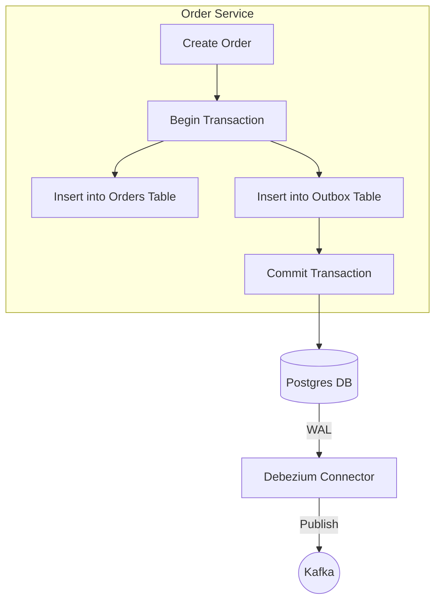

# The Outbox Pattern

## Purpose
The **Transactional Outbox Pattern** solves the "Dual Write Problem" in microservices. It ensures that a database update (e.g., saving an order) and sending a message to a message broker (e.g., Kafka) happen atomically—either both succeed or both fail.

## Concept
Instead of sending a message directly to Kafka, the service saves the message into a special table called the `outbox` within the same database transaction as the business entity. A separate process (Debezium) then polls this table and forwards the messages to Kafka.

### Why it exists
In a standard microservice:
1. `service.saveOrder(order)` (Success)
2. `kafkaTemplate.send(event)` (Network Failure / App Crash)
**Result**: Database is updated, but Kafka never knows. The downstream services (Payment, Inventory) are never triggered. The Saga is broken.

## Execution Flow



## Code References

### 1. The Outbox Entity
This entity represents the row in the `outbox_events` table.
```java
// microservices/order-service/.../entity/OutboxEvent.java
@Entity
@Table(name = "outbox_events")
public class OutboxEvent {
    @Id
    @GeneratedValue(strategy = GenerationType.UUID)
    private UUID id;

    private String aggregateType; // e.g., "Order"
    private String aggregateId;   // e.g., "order-123"
    private String type;          // e.g., "OrderCreated"
    
    @Column(columnDefinition = "TEXT")
    private String payload;       // JSON content of the event
}
```

### 2. Transactional Save
The `OrderProducerService` ensures both saves are in the same `@Transactional` block.
```java
// microservices/order-service/.../service/OrderProducerService.java
@Transactional
public void createOrderWithOutbox(String userId, double amount) {
    // 1. Save Business Entity
    OrderEntity order = ...;
    orderRepository.save(order);

    // 2. Save Outbox Event
    OrderCreatedEvent event = ...;
    OutboxEvent outbox = OutboxEvent.builder()
            .aggregateType("Order")
            .payload(objectMapper.writeValueAsString(event))
            .build();
    outboxRepository.save(outbox);
}
```

## Real World Usage
- **Order Processing**: As seen in this project.
- **User Registration**: Save user to DB, send "Welcome Email" event via Outbox.
- **Inventory Updates**: Update stock, notify search engine via Outbox.

---

## Tradeoffs

| Feature | Benefit | Cost |
|---------|---------|------|
| **Consistency** | Guaranteed delivery (At-least-once). | Extra DB write per event. |
| **Simplicity** | Easy to implement in code. | Requires CDC (Debezium) or Polling. |
| **Throughput** | High, as DB handles the atomic work. | Outbox table can grow if not cleaned up. |

---

## Common Issues & Debugging

### 1. Large Payloads
- **Issue**: Storing huge JSON in a `TEXT` column can slow down the database.
- **Solution**: Use `JSONB` in Postgres for better performance, or store large assets in S3 and only the link in the Outbox.

### 2. Table Cleanup
- **Issue**: The `outbox_events` table will grow indefinitely.
- **Solution**: 
    - Use a cleanup job to delete processed rows.
    - **Note**: Debezium doesn't delete rows. You must implement a TTL or a scheduled task.

---

## Interview Questions
1. **How do you prevent duplicate messages from the Outbox?**
   - *Answer*: Debezium guarantees "at least once." Downstream consumers must be **idempotent** (e.g., checking a `correlationId` or `orderId` before processing).
2. **Can you implement Outbox without Debezium?**
   - *Answer*: Yes, by using a background thread (Polling Publisher) that queries the table every second, sends to Kafka, and marks the row as `processed`. However, this is less efficient than CDC.

## Debugging Steps
1. **Verify DB**: `SELECT * FROM outbox_events;` - See if rows are being inserted.
2. **Verify Connector**: Check Kafka Connect logs to see if it's picking up the rows.
3. **Verify Kafka**: Use `kafka-console-consumer` to see if messages appear in the `order-created` topic.
