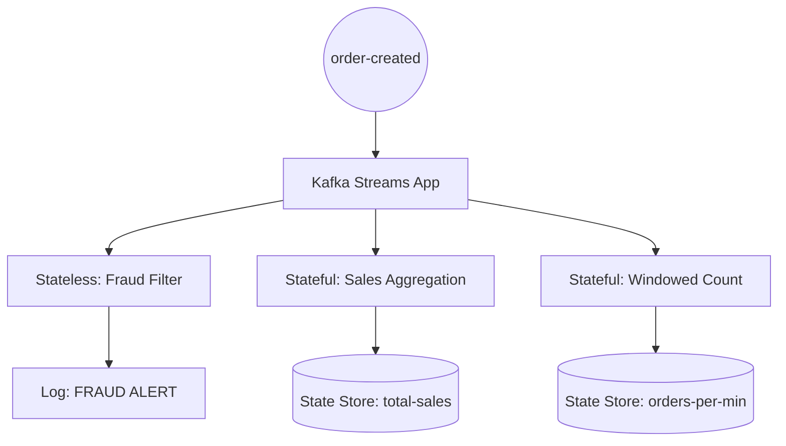

# Kafka Streams: Real-time Analytics

## Purpose
Kafka Streams is a client library for building applications and microservices, where the input and output data are stored in Kafka clusters. In this project, it powers the **Analytics Service**, providing real-time insights into sales, order velocity, and fraud detection.

## Concept
Unlike traditional processing where you pull data from a DB, Kafka Streams processes data as it flows. It allows for both **Stateless** (filtering, mapping) and **Stateful** (windowing, joining, aggregating) operations.

### Why it exists
- **Low Latency**: Insights are available milliseconds after an event occurs.
- **Scalability**: Can be scaled by simply running more instances of the service.
- **State Management**: Built-in RocksDB integration for high-performance local state.

---

## Execution Flow (Logic in Analytics Service)



## Code References (AnalyticsStreamProcessor.java)

### 1. Stateful Aggregation (Total Sales)
Calculates the running total of sales per user.
```java
stream.mapValues(OrderCreatedEvent::getAmount)
      .groupByKey(Grouped.with(Serdes.String(), Serdes.Double()))
      .reduce(Double::sum, Materialized.as("total-sales-store"))
      .toStream()
      .peek((key, value) -> log.info("Update: Total sales for user {} is now ${}", key, value));
```

### 2. Windowed Aggregation (Orders per Minute)
Uses "Tumbling Windows" to count orders in 1-minute intervals.
```java
TimeWindows window = TimeWindows.ofSizeWithNoGrace(Duration.ofMinutes(1));
stream.groupBy((key, value) -> "ALL_ORDERS")
      .windowedBy(window)
      .count(Materialized.as("order-count-window"))
```

### 3. Stateless Filtering (Fraud Detection)
A simple filter to flag high-value orders.
```java
stream.filter((key, value) -> value.getAmount() > 1000)
      .peek((key, value) -> log.warn("FRAUD ALERT: High value order detected!"));
```

---

## Real World Usage
- **Real-time Dashboards**: Feeding Grafana with live sales metrics.
- **Fraud Detection**: Instantly blocking suspicious transactions.
- **Inventory Alerts**: Notifying the warehouse when stock levels drop below a threshold (calculated via streams).

---

## Tradeoffs

| Feature | Benefit | Cost |
|---------|---------|------|
| **Stateful** | Complex aggregations possible. | Requires disk space for RocksDB. |
| **Internal Topics**| Fault tolerance for state. | Increases Kafka traffic (repartitioning). |
| **Windowing** | Time-based insights. | Handling late-arriving data. |

---

## Common Issues & Debugging

### 1. Rebalancing
- **Issue**: When a new instance starts, Kafka reassigns partitions, which can cause temporary pauses in processing.
- **Debugging**: Check logs for `State transition from RUNNING to REBALANCING`.

### 2. Serialization (Serdes)
- **Issue**: Most common error! If the Serde doesn't match the data in the topic, the app will crash.
- **Solution**: Always use the correct Avro/JSON Serde and ensure the Schema Registry is accessible.

### 3. RocksDB Errors
- **Issue**: Disk full or permission issues on the `/tmp/kafka-streams` directory.
- **Solution**: Configure a persistent volume for state storage in production.

---

## Interview Questions
1. **What is a KStream vs. a KTable?**
   - *Answer*: A **KStream** is an unbounded stream of individual events (fact stream). A **KTable** represents the latest state of a key (changelog stream).
2. **How does Kafka Streams handle state?**
   - *Answer*: It uses an embedded **RocksDB** to store state locally. To ensure fault tolerance, it backs up this state to a hidden Kafka "changelog" topic.

## Debugging Steps
1. **Interactive Queries**: You can query the `total-sales-store` directly via a REST API (if implemented) to see the current state without reading the whole topic.
2. **Topic Inspection**: Look at the hidden topics (prefixed with the app ID) in Kafka UI to see the state changelogs.
