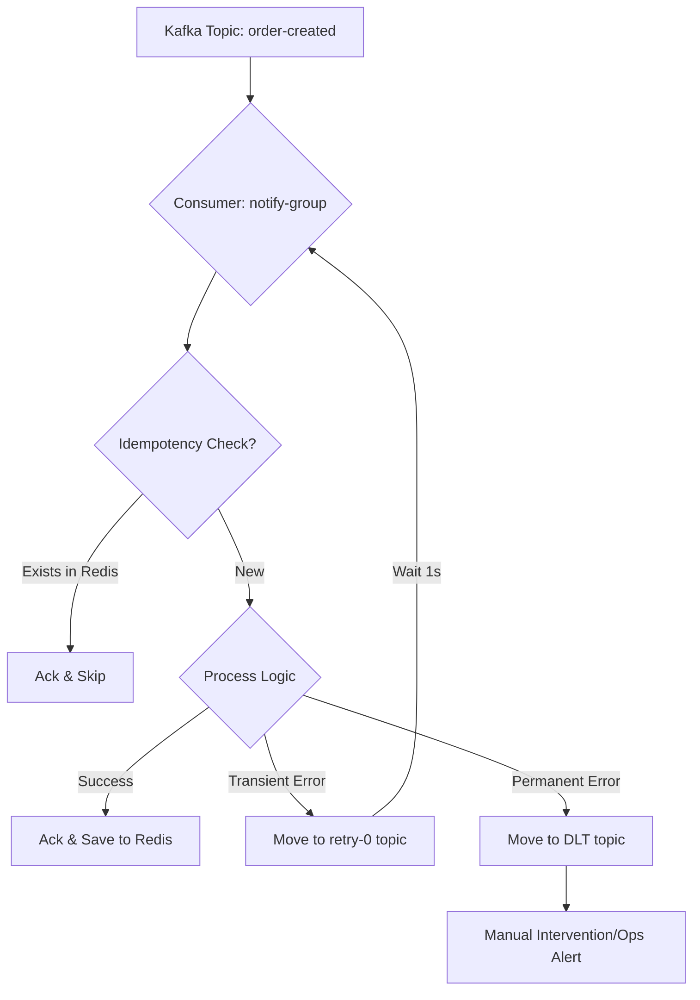
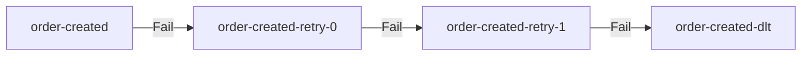

# Kafka Reliability Patterns: Retries, DLQ, and Idempotency

## Purpose
In a distributed system, failures are inevitable. Network glitches, service restarts, and "poison pill" messages can disrupt event processing. This document explains how the platform ensures reliability and message processing integrity using advanced Kafka patterns.

## Concept
Reliability in Kafka is built on three pillars:
1.  **Idempotency**: Ensuring that processing the same message multiple times has the same effect as processing it once.
2.  **Retries**: Automatically re-attempting failed operations to handle transient errors.
3.  **Dead Letter Queues (DLQ)**: Isolating unrecoverable messages to prevent them from blocking the processing pipeline.

## Why it Exists
Without these patterns:
- **Duplicates**: Network retries might cause a payment to be processed twice.
- **Data Loss**: A transient database error might cause an event to be dropped.
- **System Stalls**: A malformed "poison pill" message could cause a consumer to crash repeatedly, stopping all progress in a partition.

## Real World Usage (NatWest Context)
At a bank like NatWest, idempotency is critical for financial transactions. If a "Transfer Money" event is delivered twice due to a network retry, the system must ensure the customer isn't debited twice. Retries ensure that even if the ledger service is briefly down, the transfer eventually completes.

---

## Implementation Details

### 1. Application-Level Idempotency (Redis)
Located in `microservices/notification-service`.

Kafka provides **At-Least-Once** delivery. If a consumer crashes after processing but before committing the offset, it will receive the message again. We use Redis to track processed `correlationId`s.

**Code Reference**: `OrderEventListener.java`
```java
String idempotencyKey = IDEMPOTENCY_KEY_PREFIX + event.getCorrelationId();

// Atomic "Set if Absent" in Redis
Boolean isNew = redisTemplate.opsForValue().setIfAbsent(idempotencyKey, "PROCESSED", Duration.ofHours(24));
if (Boolean.FALSE.equals(isNew)) {
    log.warn("Duplicate message detected for correlationId: {}. Skipping...", event.getCorrelationId());
    ack.acknowledge();
    return;
}
```

### 2. Non-blocking Retries (`@RetryableTopic`)
Located in `microservices/notification-service`.

We distinguish between **Transient** and **Permanent** failures.
- **Blocking Retry**: Traditional Spring Kafka retries stop the consumer. This causes "Head of Line Blocking."
- **Non-blocking Retry**: Failed messages are moved to a retry topic (`order-created-retry-0`), allowing the main consumer to continue.

**Code Reference**: `OrderEventListener.java`
```java
@RetryableTopic(
        attempts = "3",
        backoff = @Backoff(delay = 1000, multiplier = 2.0),
        topicSuffixingStrategy = TopicSuffixingStrategy.SUFFIX_WITH_INDEX_VALUE,
        dltStrategy = DltStrategy.FAIL_ON_ERROR,
        include = {TransientFailureException.class}
)
@KafkaListener(topics = "order-created", groupId = "notification-group")
public void handleOrderCreated(OrderCreatedEvent event, Acknowledgment ack) { ... }
```

### 3. Dead Letter Queues (DLQ)
Messages that exhaust all retries are sent to `order-created-dlt`.

**DLT Handler**:
```java
@DltHandler
public void handleDlt(OrderCreatedEvent event, @Header(KafkaHeaders.RECEIVED_TOPIC) String topic) {
    log.error("Poison Pill Alert! Event {} landed in DLT of topic {}", event.getOrderId(), topic);
}
```

---

## Execution Flow (The Resilience Path)



---

## Diagrams: Retry Topology



---

## Tradeoffs

| Pattern | Pros | Cons |
| :--- | :--- | :--- |
| **Blocking Retry** | Maintains strict message ordering. | Causes lag; one bad message stops everything. |
| **Non-blocking Retry** | High throughput; prevents lag spikes. | **Breaks ordering** within a partition. |
| **Idempotency** | Prevents duplicate side-effects. | Adds dependency on Redis/external store. |

---

## Debugging Steps
1.  **Check Consumer Lag**: `docker exec kafka-1 kafka-consumer-groups --bootstrap-server localhost:9092 --group notification-group --describe`
2.  **Inspect DLT**: Use Kafka UI (`localhost:8080`) to view messages in `order-created-dlt`.
3.  **Redis Inspection**: `docker exec -it redis redis-cli KEYS "order-processed:*"`

## Interview Questions
- **Q**: What is the "Head of Line Blocking" problem in Kafka consumers?
- **A**: It occurs when a single message fails and the consumer retries it indefinitely (or many times), preventing the processing of subsequent messages in the same partition.
- **Q**: How does `@RetryableTopic` solve this?
- **A**: It moves the failed message to a separate retry topic, allowing the main consumer to move on to the next message.

## Common Issues
- **Infinite Retry Loop**: Not distinguishing between transient (network) and permanent (null pointer) exceptions.
- **Ordering Issues**: Using non-blocking retries on a topic where order is business-critical (e.g., Stock ticker).
