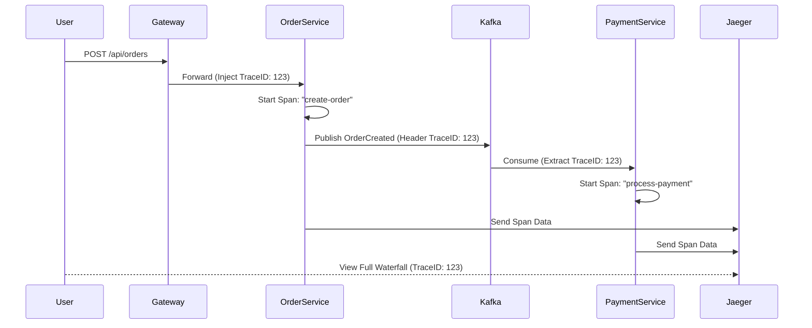

# Observability: Tracking Events in Distributed Systems

## Purpose
In a microservices architecture, a single user request can span multiple services, databases, and Kafka topics. Understanding what happened, where it happened, and why it's slow is impossible with standard logs. This document explains the observability strategy used to monitor the platform's health and performance.

## Concept
The platform follows the **Three Pillars of Observability**:
1.  **Metrics**: Numeric data over time (e.g., CPU, Consumer Lag, Request Rate).
2.  **Traces**: The path of a single request across service boundaries (using Correlation IDs).
3.  **Logs**: Structured text records of events within a service.

## Why it Exists
- **Distributed Context**: If an order fails, was it the Payment Service? Or was Kafka lagging?
- **Performance Bottlenecks**: Identifying which microservice is adding latency to the checkout flow.
- **Proactive Alerting**: Getting notified before consumers crash due to disk space or memory leaks.

## Real World Usage (NatWest Context)
At NatWest, observability is the difference between a 5-minute fix and a 5-hour outage. Tracking a payment from the mobile app through the API gateway, payment engine, and core banking ledger requires rigorous distributed tracing (Correlation IDs).

---

## Technical Stack

### 1. Micrometer & Prometheus (Metrics)
Every Spring Boot service is equipped with **Micrometer**. It exports application metrics to a `/actuator/prometheus` endpoint.
- **Scraper**: Prometheus pulls data from all services every 5 seconds.
- **Storage**: Time-series database.

### 2. OpenTelemetry & Jaeger (Distributed Tracing)
The platform uses **OpenTelemetry (OTEL)** for auto-instrumentation.
- **Trace Propagation**: Correlation IDs (TraceID/SpanID) are injected into Kafka headers.
- **Visualization**: Jaeger provides a UI to see the "waterfall" view of a request.

### 3. Actuator (Health & Info)
Standard Spring Boot Actuator endpoints are used for Kubernetes liveness/readiness probes.

---

## Code References

### 1. OpenTelemetry Configuration
Found in `microservices/order-service/src/main/resources/application.yml`:
```yaml
management:
  tracing:
    sampling:
      probability: 1.0 # Capture 100% of traces for learning
  otlp:
    tracing:
      endpoint: http://localhost:4317 # Jaeger OTLP port
```

### 2. Custom Metrics (Example)
We can track business events like `orders.placed.total`:
```java
// Logic inside OrderService
meterRegistry.counter("orders.placed", "type", "outbox").increment();
```

---

## Execution Flow (The Trace Path)



---

## Common Issues
- **Trace Context Loss**: Not passing headers from Kafka consumers back into new producer events.
- **High Cardinality**: Adding unique IDs (like `orderId`) as tags in Prometheus metrics (causes memory issues).
- **Sampling Overload**: In production, we sample 1-5% of traces; capturing 100% can overwhelm Jaeger.

## Debugging Steps
1.  **Check Actuator**: Visit `http://localhost:8082/actuator/health`.
2.  **Verify Metrics**: Visit `http://localhost:8082/actuator/prometheus` to see raw metrics.
3.  **Trace Search**: Open Jaeger (`http://localhost:16686`) and search for `order-service` operations.

## Interview Questions
- **Q**: What is the difference between a Log and a Trace?
- **A**: A log is a record of an event *inside* a service. A trace connects multiple logs/events *across* different services using a shared Correlation ID.
- **Q**: How do you monitor Kafka Consumer Lag?
- **A**: By monitoring the difference between the `Log End Offset` (latest message) and the `Current Offset` of the consumer group. We use Prometheus/Grafana for this.
