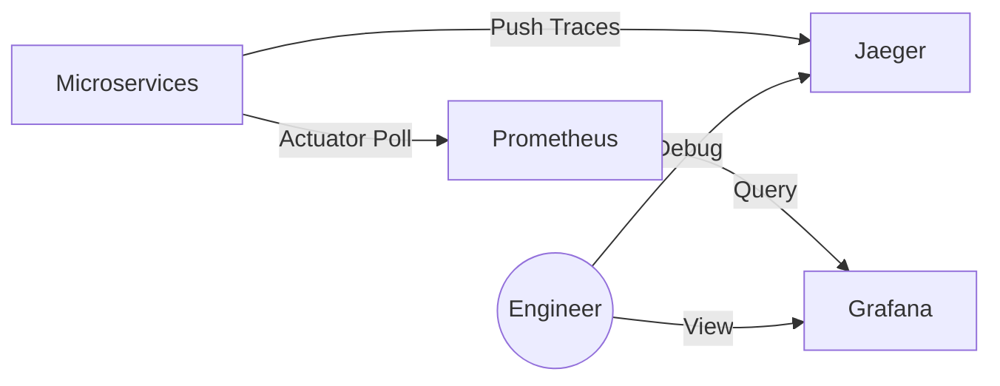

# Visualizing Health: Grafana, Jaeger, and Prometheus

## Purpose
While Prometheus and OpenTelemetry collect data, they are not optimized for human visualization. This document explains how we use Grafana and Jaeger to create a "Single Pane of Glass" for the system's operational health.

## Concept
- **Prometheus**: The Collector (Scrapes data).
- **Grafana**: The Artist (Plots charts/dashboards).
- **Jaeger**: The Detective (Drills down into specific transaction flows).

## Why it Exists
Logs tell you *what* happened in one place. Grafana tells you the *trend* (Is the system getting slower?). Jaeger tells you the *story* of a single order (Why did this specific order take 2 seconds?).

---

## Tool Deep-Dive

### 1. Prometheus (`localhost:9090`)
Configured to scrape microservices using the `host.docker.internal` bridge.
- **Job Name**: `kafka-mastery-services`
- **Scrape Interval**: 5 seconds.

**Config Reference**: `infra/prometheus/prometheus.yml`
```yaml
scrape_configs:
  - job_name: 'kafka-mastery-services'
    metrics_path: '/actuator/prometheus'
    static_configs:
      - targets: ['host.docker.internal:8082', 'host.docker.internal:8087', ...]
```

### 2. Grafana (`localhost:3000`)
The UI used to build dashboards.
- **Data Source**: Prometheus (`http://prometheus:9090`).
- **Core Dashboards**:
    - **JVM Dashboard**: Memory usage, GC counts, thread states for all microservices.
    - **Kafka Consumer Dashboard**: Lag per topic, lag per partition.
    - **Saga Outcome Dashboard**: Count of SUCCESS vs FAILED payments.

### 3. Jaeger (`localhost:16686`)
The tracing UI.
- **OTLP Endpoint**: `http://localhost:4317` (gRPC).
- **Query UI**: Allows searching by tags like `orderId` or `userId`.

---

## Execution Flow: Monitoring a Checkout



---

## Common Dashboards at NatWest
1.  **Golden Signals Dashboard**: Latency, Traffic, Errors, and Saturation (LTES).
2.  **Infrastructure Dashboard**: Docker container resource usage.
3.  **Business Logic Dashboard**: Value of processed transactions vs. failed transactions.

---

## Debugging Steps

### If Grafana is Empty:
1.  **Check Prometheus**: Go to `http://localhost:9090/targets`. Are the services "UP"?
2.  **Check Network**: In Docker, can Prometheus ping `host.docker.internal`?
3.  **Check Actuator**: Curl `http://localhost:8082/actuator/prometheus`. Is there data?

### If Jaeger has no Traces:
1.  **Check Environment Variables**: Is `OTEL_EXPORTER_OTLP_ENDPOINT` set correctly?
2.  **Check Jaeger UI**: Look at the "System Architecture" graph in Jaeger to see service dependencies.

---

## Interview Questions
- **Q**: Why do we use Prometheus for metrics and Jaeger for traces? Why not just one?
- **A**: They serve different data models. Prometheus uses a multi-dimensional time-series model (best for aggregates). Jaeger uses a graph-based model (best for linear transaction flows). Using both provides a complete picture.
- **Q**: What is a "Service Map" in Jaeger?
- **A**: It's a visual representation of how services interact, generated automatically based on the captured trace data.

## Tradeoffs
| Tool | Pros | Cons |
| :--- | :--- | :--- |
| **Prometheus** | Highly efficient; simple setup. | Limited to numeric data; data is lost if Prometheus crashes (without long-term storage). |
| **Jaeger** | Unbeatable for debugging cross-service bugs. | High storage overhead for capture; adds minor latency to every request. |
| **Grafana** | Extremely flexible; supports many data sources. | Configuration drift; dashboards can become cluttered and hard to maintain. |
