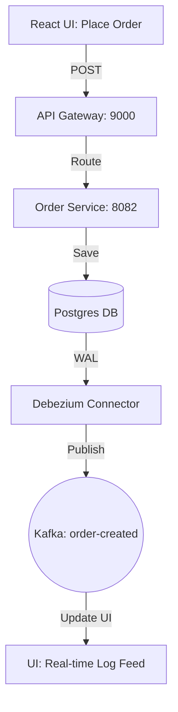

# Frontend Guide: The Kafka Visualizer

## Purpose
Apache Kafka and distributed systems are often "invisible"—logic happens in brokers and background threads. The Frontend Visualizer (Vite + React) is designed to make these invisible concepts visible, allowing developers to trigger scenarios and watch events flow through the system in real-time.

## Concept
The frontend acts as a **Learning Cockpit**. It doesn't just manage data; it explains the architecture as you use it. It provides interactive controls to simulate failures, explore the Saga state machine, and monitor infrastructure health.

## Why it Exists
- **Scenario Simulation**: Easily trigger `fail_payment` or `fail_transient` scenarios without manually crafted CURL commands.
- **Visual Learning**: Seeing a DAG (Directed Acyclic Graph) of a Saga makes choreography easier to understand than reading logs.
- **Central Hub**: Direct links and frames for Grafana, Jaeger, and Kafka UI in one place.

## Real World Usage
In a production environment, this would be the **Operational Dashboard** used by SREs (Site Reliability Engineers) to visualize system topology and trigger manual compensations if a Saga gets stuck.

---

## Technical Stack
- **Framework**: React 18
- **Build Tool**: Vite (Extremely fast HMR)
- **Styling**: Tailwind CSS (Utility-first CSS for the dashboard UI)
- **Icons**: Lucide React
- **API Client**: Axios

---

## Folder Structure
- `frontend/src/pages`: Individual dashboard views (Saga, Resilience, Metrics).
- `frontend/src/features/topology`: Logic for rendering the system architecture graph.
- `frontend/src/api`: Shared axios configuration and endpoint definitions.

---

## Key Feature: The Saga Dashboard
Located at `/saga` in the UI.

This page allows you to place orders and watch the choreography unfold.

**Code Reference**: `SagaDashboard.tsx`
```tsx
const triggerOrder = async () => {
    const endpoint = mode ? '/api/orders/outbox' : '/api/orders/async';
    await axios.post(`${endpoint}?userId=${userId}&amount=${amount}`);
};
```

### Modes:
1.  **Transactional Outbox Mode**: Atomically saves to the DB and uses Debezium to publish to Kafka. Guaranteed consistency.
2.  **Async Send Mode**: Directly calls Kafka from the service. Faster but risks the "Dual-Write" problem.

---

## Execution Flow (UI to Kafka)



---

## Debugging Steps
1.  **Check Console**: Open Chrome DevTools (F12). Look for Axios errors.
2.  **Network Tab**: Ensure requests are hitting `http://localhost:9000` (Gateway).
3.  **CORS Issues**: If the frontend can't talk to the backend, check the `@CrossOrigin` annotations in the Spring Boot controllers.

## Interview Questions
- **Q**: Why build a custom visualizer instead of just using Kafka UI?
- **A**: Kafka UI shows *topics* and *offsets*. A custom visualizer shows the *business workflow* (e.g., the status of a specific order across multiple services).
- **Q**: How does the UI stay updated with background events?
- **A**: In this prototype, it uses polling or direct API feedback. In a full production system, we would use **WebSockets** or **Server-Sent Events (SSE)**.

## Tradeoffs
| Choice | Pros | Cons |
| :--- | :--- | :--- |
| **Vite** | Instant startup; modern DX. | Requires Node.js 18+. |
| **Tailwind** | Rapid UI development; consistent design. | Can lead to "class soup" in JSX if not componentized. |
| **Single Page App (SPA)** | Smooth transitions between tools. | Requires robust error handling to prevent the whole "Cockpit" from crashing. |
