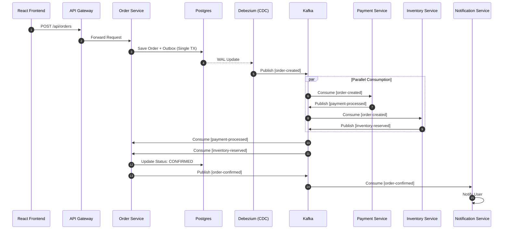

# Code Flow: The Lifecycle of an Event

## Purpose
This document provides a deep-dive, end-to-end trace of a single transaction in the platform. It connects the dots between the Frontend, API Gateway, Databases, Kafka Connect, and multiple microservices.

## Concept: The "Happy Path"
We will follow an order from the moment a user clicks "Place Order" in the React UI until it is confirmed and a notification is sent.

## Folder References
- `frontend/src/pages/SagaDashboard.tsx`: Trigger point.
- `microservices/order-service`: The Saga Initiator.
- `microservices/payment-service`: Saga Participant 1.
- `microservices/inventory-service`: Saga Participant 2.
- `microservices/notification-service`: The Final Consumer.

---

## Phase 1: Request & Persistence
1.  **Frontend**: User submits the order form. Axios calls `POST http://localhost:9000/api/orders/outbox`.
2.  **API Gateway**: Routes the request to `order-service` on port 8082.
3.  **Order Service**: 
    - Starts a database transaction.
    - Saves an `OrderEntity` with status `PENDING` to the `orders` table.
    - Saves an `OutboxEvent` containing the `OrderCreatedEvent` payload to the `outbox_events` table.
    - Commits the transaction.

## Phase 2: Event Emission (CDC)
1.  **Postgres WAL**: The write-ahead log records the new row in `outbox_events`.
2.  **Debezium**: Scans the WAL, detects the change, and publishes the event to the Kafka topic `order-created`.
3.  **Schema Registry**: Debezium fetches the Avro schema to ensure the message is correctly formatted.

## Phase 3: Distributed Processing (Saga Choreography)
1.  **Payment Service**: Consumes `order-created`.
    - Attempts to charge the user.
    - Emits `PaymentProcessedEvent` (Status: SUCCESS) to `payment-processed` topic.
2.  **Inventory Service**: Consumes `order-created`.
    - Decrements stock count.
    - Emits `InventoryReservedEvent` (Status: SUCCESS) to `inventory-reserved` topic.

## Phase 4: Convergence & Notification
1.  **Order Service (SagaOutcomeListener)**: Listens to both `payment-processed` and `inventory-reserved`.
    - Once both "Success" events arrive for the same `orderId`, it updates the `OrderEntity` status to `CONFIRMED`.
    - Emits `OrderConfirmedEvent` to `order-confirmed`.
2.  **Notification Service**: Consumes `order-confirmed`.
    - Performs an **Idempotency Check** in Redis using the `correlationId`.
    - Logs/Sends the notification.
    - Manually acknowledges the Kafka offset.

---

## Sequence Diagram: The Full Flow



---

## Code References (Tracing the Logic)

### 1. The Trigger (`OrderProducerService.java`)
```java
@Transactional
public void createOrderWithOutbox(String userId, double amount) {
    OrderEntity order = saveOrder(userId, amount);
    OutboxEvent outbox = createOutbox(order);
    outboxRepository.save(outbox);
}
```

### 2. The Join Point (`SagaOutcomeListener.java`)
```java
@KafkaListener(topics = "payment-processed", groupId = "order-saga-group")
public void handlePayment(PaymentProcessedEvent event) {
    SagaState state = sagaRegistry.get(event.getOrderId());
    state.paymentSuccess = true;
    checkCompletion(state);
}
```

---

## Common Issues & Debugging
- **Stuck Sagas**: An event is lost, and the order stays `PENDING` forever.
    - **Fix**: Check `sagaRegistry` (in memory or DB) for missing outcomes.
- **CDC Lag**: Debezium is slow to pick up WAL changes.
    - **Fix**: Check Postgres CPU and Debezium connector status (`http://localhost:8083/connectors/outbox-connector/status`).
- **Idempotency Key Collision**: Multiple orders getting the same `correlationId`.
    - **Fix**: Ensure UUID generation is robust.

## Interview Questions
- **Q**: Why use Debezium for the Outbox pattern instead of just sending to Kafka in the same Java method?
- **A**: Sending to Kafka is a network call. If the Kafka call fails *after* the database commit, you have a "Dual-Write" failure. Debezium ensures that if it's in the DB, it *will* eventually be in Kafka.
- **Q**: How do you handle a "Rollback" in this flow?
- **A**: If `payment-processed` returns `FAILED`, the `OrderService` emits a `RefundPaymentEvent` or `ReleaseInventoryEvent`. This is a **Compensating Transaction**.

## Tradeoffs
- **Latency**: The Outbox pattern adds a few milliseconds of latency as Debezium needs to scan the WAL.
- **Complexity**: Monitoring 5+ services and 4+ topics is harder than a single monolithic database transaction.
- **Resilience**: The system can survive any individual service being down.
