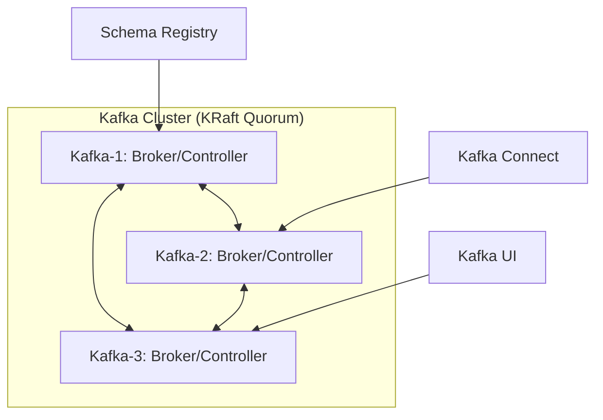
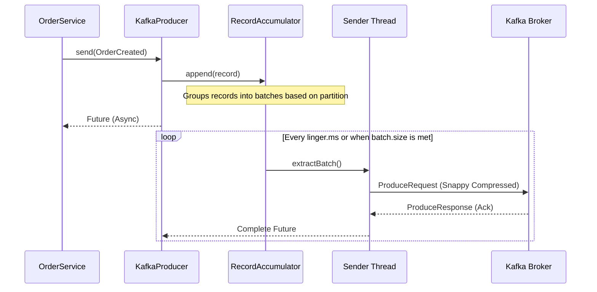

# 19. Kafka Internals & Architecture Deep Dive

## Purpose
To provide a low-level understanding of how Kafka is configured and optimized within the NatWest E-Commerce Platform. This document moves beyond "how to use" and explains "how it works" under the hood, specifically focusing on our KRaft-based cluster and producer/consumer internals.

## Concept
Kafka is not just a message queue; it is a distributed commit log. In our architecture, it serves as the "Source of Truth" for event propagation between microservices.

### 1. Cluster Architecture (KRaft Mode)
Unlike legacy Kafka which requires Zookeeper, our cluster uses **KRaft (Kafka Raft)**. This simplifies operations by consolidating metadata management into Kafka itself.

#### Why KRaft?
- **Simplified Stack:** No separate Zookeeper ensemble to manage.
- **Faster Recovery:** Controller failover is significantly faster.
- **Scalability:** Supports millions of partitions more efficiently.

#### Cluster Configuration (Reference: `docker-compose.yml`)
- **Nodes:** 3 Brokers (`kafka-1`, `kafka-2`, `kafka-3`).
- **Roles:** All nodes act as both `broker` and `controller`.
- **Quorum Voters:** `1@kafka-1:29093, 2@kafka-2:29093, 3@kafka-3:29093`.
- **Replication Factor:** 3 (configured for offsets and transaction logs).



### 2. Producer Internals & Performance Tuning
Our producers are tuned for a balance between **durability** and **throughput**.

#### Key Configurations (Reference: `order-service/application.yml`)
| Property | Value | Why it exists |
| :--- | :--- | :--- |
| `acks` | `all` | Ensures the leader and all followers acknowledge the write. Essential for financial data. |
| `enable.idempotence` | `true` | Prevents duplicate messages if a producer retries on network failure. |
| `batch.size` | `65536` (64KB) | Groups messages to reduce network overhead. |
| `linger.ms` | `20` | Wait time to fill the batch. Trade-off: higher latency for higher throughput. |
| `compression.type` | `snappy` | Compresses data before sending. Snappy is preferred for low CPU usage. |
| `max.in.flight.requests.per.connection` | `5` | Allows concurrent writes while maintaining order (with idempotence). |

#### Producer Flow Sequence


### 3. Transactional Outbox Pattern
To ensure "Atomic Writes" (saving to DB and sending to Kafka as one unit), we use the **Outbox Pattern**.

- **Step 1:** The service saves the business entity (e.g., `Order`) and an `OutboxEvent` in the same Postgres transaction.
- **Step 2:** A Debezium Kafka Connector (`infra/debezium-outbox-connector.json`) streams changes from the `outbox` table to Kafka.

#### Code Reference (`OrderProducerService.java`)
```java
@Transactional
public void createOrderWithOutbox(String userId, double amount) {
    // 1. Save Business Entity
    orderRepository.save(order);
    
    // 2. Save Outbox Event (In same transaction)
    outboxRepository.save(outboxEvent);
}
```

### 4. Consumer Internals
Consumers use **Consumer Groups** to parallelize processing.

- **Rebalance:** If a consumer instance dies, Kafka reassigns its partitions to other members.
- **Specific Avro Reader:** Enabled in `application.yml` to ensure strongly-typed POJO generation from Avro schemas.

## Real World Usage: NatWest Scale
In a production bank environment, `acks=all` is non-negotiable for money movement. We use `linger.ms=20` to handle high-frequency trading peaks without overwhelming the network with tiny packets.

## Debugging Steps
1. **Check Metadata:** Use `kafka-topics --describe` to check if replicas are in-sync (ISR).
2. **Monitor Batches:** Use JMX metrics `record-send-rate` and `average-batch-size`.
3. **Log Analysis:** Look for `NetworkException` or `TimeoutException` in microservice logs.

## Tradeoffs
- **Latency vs Throughput:** `linger.ms=20` adds 20ms of artificial latency but increases total capacity by 5-10x.
- **CPU vs Bandwidth:** Snappy compression uses CPU but saves 50% on disk and network IO.
- **Complexity vs Consistency:** The Outbox pattern adds a DB table but guarantees no messages are lost if the service crashes after a DB commit.
