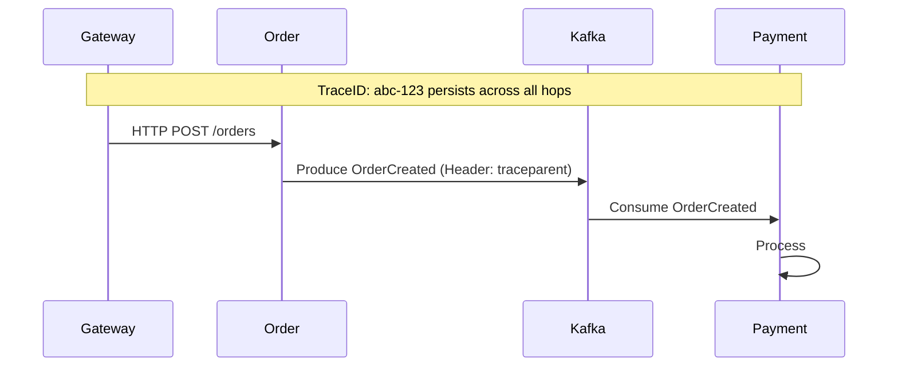

# 20. Debugging & Observability Guide

## Purpose
This guide provides engineers with the tools and methodologies required to diagnose issues in our distributed event-driven system. In a microservices architecture, debugging a single request requires tracing it across multiple services and Kafka topics.

## Concept: The Observability Trinity
We use three pillars to debug the platform:
1. **Metrics:** What is happening? (Prometheus/Grafana)
2. **Logs:** Why is it happening? (ELK/Standard Out)
3. **Traces:** Where is it happening? (Jaeger/OpenTelemetry)

### 1. Distributed Tracing with Jaeger
Every request is injected with a `traceId`. This ID travels through Kafka headers.

- **URL:** `http://localhost:16686`
- **Configuration:** `application.yml` -> `management.tracing.sampling.probability: 1.0`
- **Usage:** Search for a `traceId` to see the sequence of events from `order-service` -> Kafka -> `payment-service` -> `inventory-service`.



### 2. Monitoring with Prometheus & Grafana
- **Prometheus:** Scrapes metrics from `/actuator/prometheus`.
- **Grafana:** Visualizes Kafka throughput, consumer lag, and JVM health.
- **Key Metric for Kafka:** `kafka_consumer_group_lag` - if this increases, your consumers are too slow!

### 3. Kafka UI: The Swiss Army Knife
- **URL:** `http://localhost:8080`
- **Capabilities:**
    - View all topics and partitions.
    - Inspect message payloads (Avro deserialization happens automatically via Schema Registry).
    - Check Consumer Group offsets and lag.
    - Manually produce messages for testing.

## Execution Flow: Debugging a Failed Order
If a user reports an order is "Stuck":

1. **Step 1: Check Kafka UI.** Is the `order-created` event in the topic? 
   - *No?* Check `order-service` logs for producer errors or DB transaction rollbacks.
2. **Step 2: Check Consumer Lag.** Is `payment-service` consuming from `order-created`?
   - *Lag > 0?* The payment service is either down or processing too slowly.
3. **Step 3: Check Jaeger.** Find the `traceId` for the order. Did it reach the payment service?
   - *Stop at Kafka?* Check if the message is "Poison Pill" (failed deserialization).
4. **Step 4: Check Logs.** Look for "Dead Letter Queue" or "Retries Exhausted" messages.

## Common Issues & Fixes

### Issue: "Poison Pill" (Deserialization Error)
- **Symptom:** Consumer stops processing and logs `SerializationException`.
- **Cause:** A message was produced with an incompatible schema.
- **Fix:** 
    1. Identify the offset using Kafka UI.
    2. Update the consumer to handle the new schema or skip the offset (emergency only).
    3. Use the `common-library` Avro schemas to ensure consistency.

### Issue: Consumer Rebalance Storm
- **Symptom:** Logs show `Rebalancing` repeatedly; processing stops.
- **Cause:** A consumer is taking too long to process a single message (exceeding `max.poll.interval.ms`).
- **Fix:** 
    1. Optimize the processing logic.
    2. Increase `max.poll.interval.ms`.
    3. Decrease `max.poll.records`.

### Issue: Duplicate Messages
- **Symptom:** Payment processed twice for one order.
- **Cause:** Consumer processed the message but crashed before committing the offset.
- **Fix:** Implement **Idempotency** in the consumer. Check the DB if the `orderId` was already processed before doing business logic.

## Debugging Commands
```bash
# Get list of topics
docker exec -it kafka-1 kafka-topics --bootstrap-server localhost:9092 --list

# View messages in a topic (Console Consumer)
docker exec -it kafka-1 kafka-console-consumer --bootstrap-server localhost:9092 --topic order-created --from-beginning

# Check Consumer Group Status
docker exec -it kafka-1 kafka-consumer-groups --bootstrap-server localhost:9092 --group order-group --describe
```

## Real World Usage
At NatWest, we use **Synthetic Transactions**. Every minute, a bot places a dummy order. If the Jaeger trace doesn't complete within 5 seconds, an alert is triggered in PagerDuty before real customers are affected.
