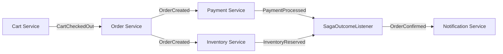

# 21. Kafka Interview Notes & Architectural Deep Dive

## Purpose
This document prepares engineers for technical discussions regarding the platform's design choices. It focuses on the "Why" behind the architecture, contrasting our implementation with alternatives.

## 1. Delivery Guarantees
**Question:** How does this platform ensure exactly-once processing?

**Answer:** 
Strictly speaking, Kafka provides **Exactly-Once Semantics (EOS)** between Kafka topics using transactions. However, when side effects (DB writes) are involved, we use:
1. **Producer Idempotence:** (`enable.idempotence: true`) ensures no duplicates are written to Kafka on retry.
2. **Transactional Outbox:** Ensures the message is only "visible" to Kafka Connect if the DB transaction succeeds.
3. **Consumer Idempotency:** The downstream service (e.g., `payment-service`) checks its database if the `eventId` or `orderId` has already been processed before taking action.

## 2. Kafka vs. RabbitMQ
**Question:** Why did we choose Kafka over RabbitMQ for this E-commerce platform?

**Answer:**
| Feature | Kafka (Our Choice) | RabbitMQ |
| :--- | :--- | :--- |
| **Storage** | Messages are persisted (Log). Can be replayed. | Messages are deleted after consumption. |
| **Throughput** | High (GBs per second). Sequential disk IO. | Moderate (KBs per second). |
| **Consumer Pattern** | Pull-based (Dumb broker, smart consumer). | Push-based (Smart broker, dumb consumer). |
| **Ordering** | Guaranteed within a partition. | Difficult with multiple consumers. |

**NatWest Context:** We need to "replay" events to rebuild the `analytics-service` state from scratch. Kafka's log retention makes this easy.

## 3. The Saga Pattern (Choreography vs. Orchestration)
**Question:** How do you handle distributed transactions across services?

**Answer:**
We use **Saga Choreography**.
- There is no central "master" service.
- Each service listens to events and decides what to do next.
- *Example:* `payment-service` listens for `OrderCreated`. Once payment succeeds, it emits `PaymentProcessed`. `inventory-service` listens for `PaymentProcessed`.
- **Tradeoff:** Choreography is decoupled but harder to visualize. Orchestration (using a tool like Camunda or a dedicated Saga Manager) is easier to track but creates a central point of failure.

## 4. Partitions and Scalability
**Question:** How do you decide the number of partitions for a topic?

**Answer:**
Formula: `Partitions = Max(Target Throughput / Producer Throughput, Target Throughput / Consumer Throughput)`.
In our dev environment, we use 3 (matching broker count). In production, we typically use 12 or 24 to allow for scaling out consumer instances without changing topic metadata.

## 5. Rebalancing & Consumer Lag
**Question:** What happens when a new instance of `order-service` is started?

**Answer:**
1. The new instance sends a `JoinGroup` request to the Group Coordinator (one of the brokers).
2. Kafka triggers a **Rebalance**.
3. Stop-the-world: Consumers stop processing briefly.
4. Partitions are reassigned (e.g., if there were 3 partitions and 1 consumer, now 2 consumers get 1 or 2 partitions each).
5. **Interview Tip:** Mention **Cooperative Sticky Assignor** to reduce rebalance downtime.

## 6. Schema Evolution
**Question:** How do you handle breaking changes in the event structure?

**Answer:**
We use **Confluent Schema Registry** with **Forward/Backward Compatibility**.
- **Backward Compatibility (Default):** New code can read old data. (e.g., adding an optional field).
- **Breaking Change:** If we must delete a field, we create a new topic (e.g., `order-created-v2`) and migrate consumers.

## 7. Performance Knobs
**Question:** If the producer is slow, which settings do you check?

**Answer:**
- `batch.size` and `linger.ms`: Increase to improve throughput.
- `compression.type`: Use `lz4` or `snappy` to reduce network IO.
- `buffer.memory`: If the app is blocking, increase the buffer size.
- `acks`: If you don't need `all`, use `1` for a speed boost (at the cost of durability).

## Diagram: Saga Workflow

*(Ref: SagaOutcomeListener.java in microservices/order-service)*
