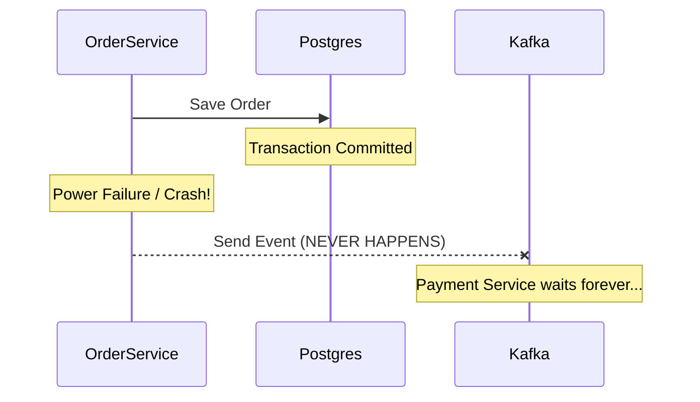

# 22. Common Mistakes & Anti-Patterns

## Purpose
To document "what NOT to do" based on common failures observed in production environments. This ensures NatWest engineers avoid costly mistakes that lead to data loss or system-wide outages.

## 1. Blocking the Producer (Sync vs. Async)
**Mistake:** Calling `.get()` on the Kafka `Future` inside a high-traffic REST controller.

**Why it's bad:** Kafka's strength is its asynchronous nature. If you block for an ACK on every request, your service throughput will drop to the speed of the slowest broker's disk IO.

**Anti-Pattern Code:**
```java
// BAD: Service hangs if Kafka is slow
public void syncSend(Event event) {
    kafkaTemplate.send("topic", event).get(); // Blocks thread
}
```

**Correct Pattern:** Use the `Outbox Pattern` or `CompletableFuture` callbacks.

## 2. The "Ghost Message" (Missing Outbox)
**Mistake:** Writing to the Database and then manually sending a message to Kafka in two separate steps without a transaction.

**Scenario:**
1. Save Order to DB (Success)
2. Kafka is down/Network flicker.
3. Message is NOT sent.
4. **Result:** The order exists in the DB, but Payment and Inventory services never know about it. Data is inconsistent.

**Fix:** Use the **Transactional Outbox** pattern (already implemented in `OrderProducerService.java`).

## 3. Improper Partition Key Selection
**Mistake:** Using a random UUID or a low-cardinality field (like `status`) as the partition key.

**Why it's bad:** 
- **Random UUID:** You lose message ordering for a specific entity.
- **Low Cardinality:** If you have 10 partitions and only 2 statuses ("ACTIVE", "INACTIVE"), only 2 partitions will do all the work while the other 8 are idle.

**Correct Pattern:** Use the entity's unique ID (e.g., `orderId`, `userId`) as the key to ensure all events for that specific entity land in the same partition and are processed in order.

## 4. Infinite Retry Loops (The "Poison Pill")
**Mistake:** Setting up a consumer to retry indefinitely on a `SerializationException`.

**Scenario:** 
A message with a bad format arrives. The consumer fails to parse it, retries, fails again... forever. This blocks the entire partition for all other users.

**Fix:** 
1. Use a **Dead Letter Queue (DLQ)** topic.
2. Configure a `DefaultErrorHandler` with a limited number of retries (e.g., 3).
3. Log the error and move to the next message.

## 5. Ignoring Schema Registry
**Mistake:** Sending raw JSON strings or byte arrays without a schema.

**Why it's bad:** Downstream consumers have no contract. If you change a field name in the producer, every consumer will crash.

**Correct Pattern:** Use **Avro** and the **Schema Registry**. It enforces a contract and allows for safe schema evolution.

## 6. Large Payloads in Kafka
**Mistake:** Trying to send a 10MB PDF or Image through a Kafka topic.

**Why it's bad:** Kafka is optimized for small messages (typically < 1MB). Large messages clog the `RecordAccumulator`, increase memory pressure, and slow down replication.

**Fix (Claim Check Pattern):**
1. Upload the file to S3/Azure Blob.
2. Send a Kafka message with the **URL** to the file.

## 7. Hardcoding Topics
**Mistake:** String literals like `kafkaTemplate.send("my-topic-name", ...)` scattered across the codebase.

**Fix:** Use a central `TopicConfig` class or fetch names from `application.yml`.

## Summary Table: Developer Checklist
| Check | Requirement |
| :--- | :--- |
| **Ordering** | Is the partition key consistent for the entity? |
| **Durability** | Is `acks=all` used for critical data? |
| **Consistency** | Is the Outbox pattern used for DB-to-Kafka flows? |
| **Safety** | Does the consumer have a DLQ for malformed messages? |
| **Contract** | Is the Avro schema registered in Schema Registry? |

## Sequence of Failure (No Outbox)

*(In this platform, we solve this by saving the event to the DB `outbox` table in the same transaction as the Order.)*
