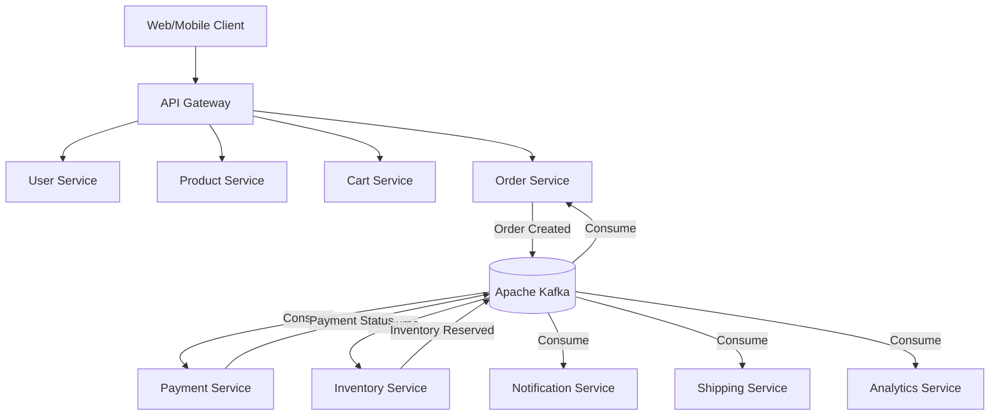

# Architecture & Design Decisions

This document outlines the high-level architecture of the **Event-Driven E-Commerce Platform**.

## 🏗️ System Overview
The system is built as a set of decoupled, loosely coordinated microservices communicating asynchronously via Apache Kafka. Synchronous calls (e.g., REST) are kept to a strict minimum, generally only terminating at the API Gateway or for strict request-reply flows where eventual consistency is not acceptable.

### Component Diagram

## 🛠️ Technology Stack
- **Backend Framework:** Java 17+, Spring Boot 3.x
- **Event Broker:** Apache Kafka (KRaft mode, 3 Brokers)
- **State Stores:** PostgreSQL (Relational), Redis (Caching / Locks)
- **Streaming:** Kafka Streams
- **CDC:** Debezium
- **Infrastructure:** Docker, Docker Compose (Kubernetes in Phase 8)
- **Frontend:** React + Vite + Tailwind (Visualizer)

## 🧩 Architectural Patterns

### 1. Choreography-based Saga
When an order is created, the system uses an event choreography approach. The Order Service emits an `OrderCreated` event. Payment and Inventory services react to it independently and emit `PaymentProcessed` or `InventoryReserved` events. Order Service listens to these outcomes to transition the order state.

### 2. Outbox Pattern
To prevent dual-write issues (writing to PostgreSQL and Kafka), services will write to an Outbox table in the same local database transaction. A Debezium connector will tail the WAL (Write-Ahead Log) and safely push these events to Kafka ensuring At-Least-Once delivery.

### 3. CQRS (Command Query Responsibility Segregation)
Read models (e.g., in the API Gateway or a dedicated query service) will be materialized by consuming Kafka events, optimizing for high-throughput reads while separating the complex write logic.

### 4. Dead Letter Queues (DLQ) & Retry Topics
Non-blocking retries will be implemented using a series of backoff topics (e.g., `topic-retry-1m`, `topic-retry-5m`). Unprocessable events are routed to a DLQ for manual inspection.

## 🗂️ Folder Structure
- `infra/`: Docker compose files, prometheus/grafana configs.
- `microservices/`: Individual Spring Boot applications.
- `frontend/`: React app for learning visualizations.
- `docs/`: Architectural documentation and Kafka internals study guides.

## 🎓 Concepts Learned in Phase 0
- **Why KRaft over Zookeeper?** KRaft simplifies the architecture, removing a separate system dependency, and allows Kafka to handle more partitions by consolidating the metadata log.
- **Why 3 Brokers?** To demonstrate leader election, In-Sync Replicas (ISR), and fault tolerance. A replication factor of 3 allows the cluster to survive 1 broker failure while maintaining a quorum.
- **Schema Registry:** Enforces schema evolution compatibility (Avro/Protobuf) preventing producer/consumer mismatches in a distributed setup.